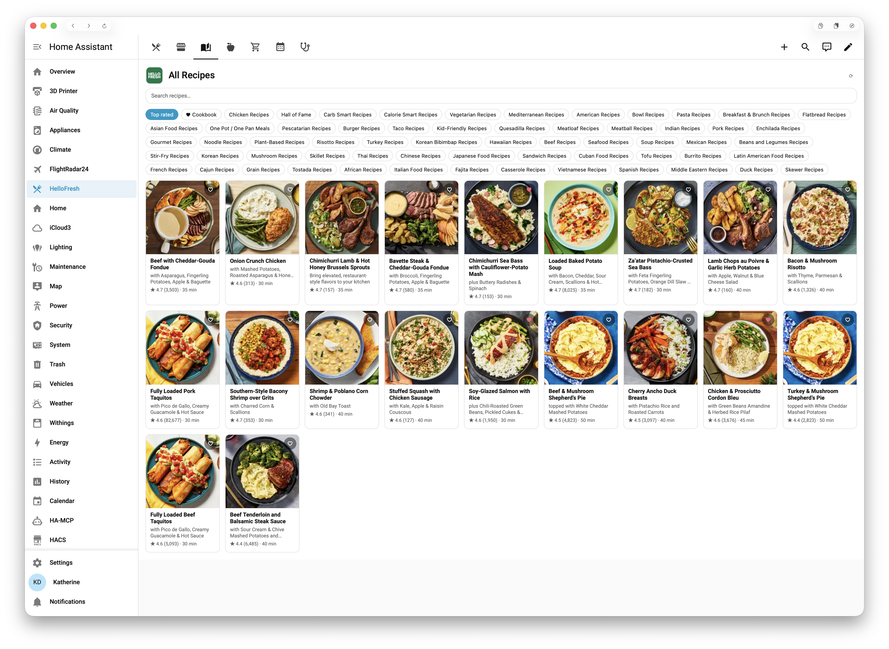
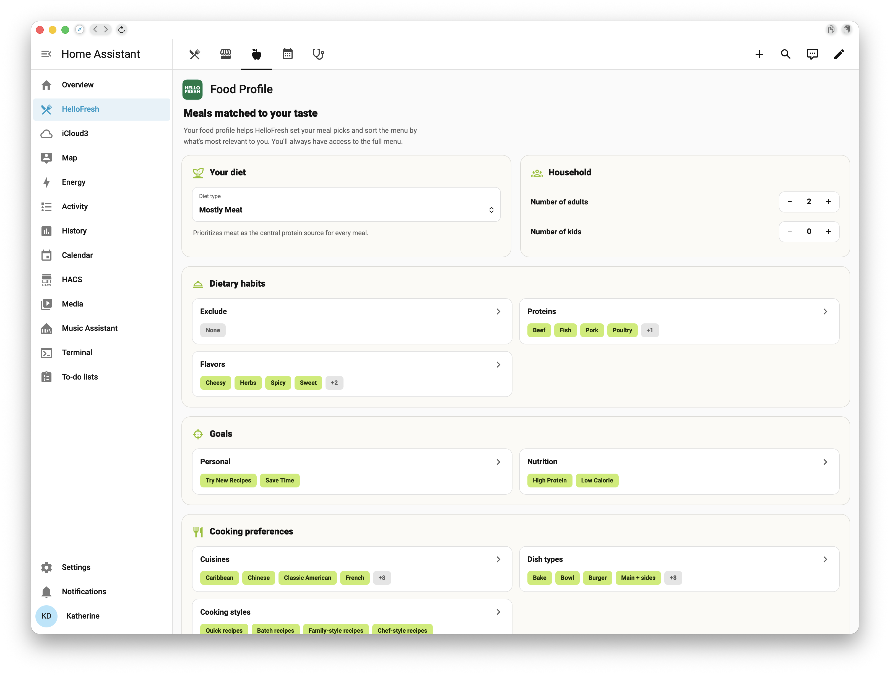

# HelloFresh Integration for Home Assistant

A custom Home Assistant integration that reads your HelloFresh account and menu data so you can track upcoming deliveries, shipment status, recipe selection deadlines, and week-by-week meal planning — and browse and edit your meals and HelloFresh Market add-ons — directly from Home Assistant.

It also exposes delivery-history summaries, shipment tracking metadata, billing/payment dates, and authenticated menu and profile details when those endpoints are available for your region and account.

> ⚠️ This is an **unofficial** integration, reverse-engineered from the HelloFresh website. It is not affiliated with or endorsed by HelloFresh, and the underlying API may change at any time.

[](https://github.com/kedube/ha-hellofresh/actions/workflows/ci.yml)
[](https://hacs.xyz/)

## Contents

- [Installation](#installation)
- [Configuration](#configuration)
  - [Supported regions](#supported-regions)
- [What It Provides](#what-it-provides)
  - [Entities](#entities) — full reference in [docs/entities.md](docs/entities.md)
  - [Automation ideas](#automation-ideas)
- [HelloFresh Dashboard](#hellofresh-dashboard)
  - [Meal planner card](#meal-planner-card)
  - [Market card](#market-card)
  - [Food Profile card](#food-profile-card)
  - [Schedule card](#schedule-card)
  - [Subscription card](#subscription-card)
  - [Cost card](#cost-card)
  - [Recorder attribute sizes](#recorder-attribute-sizes)
- [Current Scope](#current-scope)
- [Troubleshooting](#troubleshooting)
- [Diagnostics](#diagnostics)
- [Development](#development)
- [References](#references)

## Installation

> Home Assistant requirement:
>
> - Home Assistant Core with support for config flows, diagnostics, and custom integrations

### Method 1: HACS custom repository

1. In Home Assistant, open **HACS**.
2. Open the menu in the top-right corner (**⋮**) and select **Custom repositories**.
3. Paste this repository's URL: `https://github.com/kedube/ha-hellofresh`
4. Set the category to **Integration** and click **Add**.
5. Search for **HelloFresh** in HACS, open it, and click **Download**.
6. Restart Home Assistant.

After restart, add the integration from Home Assistant:

[](https://my.home-assistant.io/redirect/config_flow_start/?domain=hellofresh)

### Method 2: Manual installation

1. Copy `custom_components/hellofresh` into your Home Assistant `config/custom_components` directory.
2. Restart Home Assistant.
3. Add the integration from **Settings > Devices & services > Add integration**.

[](https://my.home-assistant.io/redirect/config_flow_start/?domain=hellofresh)

## Configuration

HelloFresh has no official API or OAuth app. Setup offers **two ways** to connect, chosen from a menu when you add the integration:

- **Email and password (recommended)** — the integration logs in the same way the website does, obtaining a short-lived access token plus a long-lived refresh token, then keeps the connection refreshed automatically. No developer tools or token copying required.
- **Access token (advanced backup)** — paste your HelloFresh `apiV2Auth` token from a logged-in browser session. Use this only if email/password sign-in is blocked for you (see [Troubleshooting](#troubleshooting)). It works until the token expires (~60 days), then prompts you for a fresh one.

### Setting up (email and password — recommended)

1. Add the integration (see [Installation](#installation)).
2. Choose **Email and password (recommended)**.
3. Choose your **Country** (see [Supported regions](#supported-regions)).
4. Enter the **email** and **password** you use to sign in to HelloFresh.
5. Submit. Home Assistant signs in, validates the account, and stores the resulting tokens so it can refresh access on its own.

> 🔒 **About your credentials.** Your email and password are stored in the Home Assistant config entry and used only to log in to HelloFresh's own login endpoint and to re-authenticate when the refresh token eventually expires. They are redacted from diagnostics exports. As with any third-party integration, the security of your credentials depends on the security of your Home Assistant installation.

### Setting up (access token — advanced backup)

Use this only when email/password sign-in is blocked. The setup dialog includes step-by-step directions; in short:

1. Add the integration and choose **Access token (advanced)**, then your **Country**.
2. In a desktop browser, sign in to your regional HelloFresh website so you reach your account page.
3. Open developer tools (right-click → **Inspect**, or **F12**), open the cookies view (**Chrome/Edge:** Application → Cookies; **Firefox:** Storage → Cookies), select your HelloFresh site, and copy the **Value** of the **`apiV2Auth`** cookie.
4. Paste it into the token field and submit. A full `apiV2Auth` value includes the refresh token for the longest-lasting connection; a bare access token also works but is shorter-lived.

> ⚠️ A token-only entry **cannot self-heal**: when the refresh token expires (~60 days) or HelloFresh rotates it, there are no stored credentials to log back in, so Home Assistant raises a reauthentication prompt asking for a new token. Prefer email/password whenever it works.

### Why bot protection can matter

HelloFresh fronts its sites with Cloudflare. To pass that layer the integration presents as a real **Google Chrome on Windows 11** browser, including a genuine Chrome TLS/HTTP-2 fingerprint via the bundled `curl_cffi` dependency (installed automatically). Most regions accept this; a region with stricter bot-management rules may still block automated sign-in, which is what the access-token backup path is for.

### Reauthentication

The integration renews the short-lived access token automatically using the long-lived refresh token. For **email/password** entries it falls back to a full login with your stored credentials when the refresh token is rejected or expired; if that login fails (for example you changed your password), Home Assistant prompts you to re-enter your email and password. For **token-only** entries there are no stored credentials, so reauthentication instead asks you to paste a fresh `apiV2Auth` token.

### Options

These settings are adjusted *after* setup, in the integration's **Configure** dialog — separate from the initial connect flow. To open it:

1. Go to **Settings → Devices & Services**.
2. On the **Integrations** tab, find the **HelloFresh** card (or click the badge below to jump straight there).
3. Click **Configure** on the HelloFresh entry. (If you have multiple HelloFresh accounts, each entry has its own **Configure** with independent options.)
4. Adjust the fields described below and click **Submit**.

[](https://my.home-assistant.io/redirect/integration/?domain=hellofresh)

> 💡 **Configure vs. Add.** Use **Configure** (the button on an *existing* entry) to change these options. The **Add integration** flow is only for connecting a new account, and changes here take effect without re-entering your credentials.

The available options are:

- **Refresh interval (minutes)** — how often account data is polled. Default is **180**; allowed range is **5–1440**. (This is the data-refresh cadence; the bearer token is refreshed on its own faster-running schedule regardless of this value.)
- **Use public menu fallback** — when authenticated menu data is unavailable, scrape the public regional menu page so recipe data still appears.
- **Weeks of past history to load** — how many weeks of past deliveries to fetch and make browsable in the cards. Default is **26** (about 6 months); allowed range is **1–104**. Lower it to reduce how much data is pulled each refresh if you don't need a long history; raise it to browse further back (use **~56** for a full year, so the box from ~12 months ago is included). Changing it reloads the integration.
- **Full menu history (weeks)** — how long after its delivery date a week keeps its **full browsable menu** in the meal-planner card (with your delivered meals highlighted) before collapsing to just the delivered meals. Default is **2 weeks** (the last couple of boxes stay browsable); allowed range is **0–3**, where **0** turns the grace window off entirely. HelloFresh stops publishing the real menu for older weeks, so a week whose menu can't be validated falls back to delivered-only automatically regardless of this setting. Changing it reloads the integration.

### Supported regions

Choose the matching country during setup. **Status** reflects real-world testing: ✅ = verified end to end (including write actions); *Untested* = the region is wired up and should work for reading, but no one has confirmed it — reports welcome.

| Region | Code | Website | Status |
| --- | --- | --- | --- |
| United States | `us` | https://www.hellofresh.com | ✅ Verified |
| United Kingdom | `uk` | https://www.hellofresh.co.uk | ✅ Verified |
| Canada | `ca` | https://www.hellofresh.ca | Untested |
| Australia | `au` | https://www.hellofresh.com.au | Untested |
| Germany | `de` | https://www.hellofresh.de | Untested |
| Netherlands | `nl` | https://www.hellofresh.nl | Untested |

## What It Provides

### Entities


The integration creates **50+ entities** per HelloFresh account:

- **Sensors** covering deliveries & orders (dates, weeks, delivery window, holiday shifts), meal selection (deadlines, meal/market counts, preselection flags), billing & payments (box price, account credit, payment dates, coupons), account & subscription (plan, servings, status), shipment tracking (status, carrier, tracking link), and history & skipped weeks — plus diagnostic sensors for token expiry and the API base URL.
- **Binary sensors** for automations — most notably `binary_sensor.needs_meal_selection`, the primary signal for "review your meals before the cutoff" reminders — plus tracked-shipment availability and parse-health diagnostics.
- A **delivery calendar** (`calendar.delivery_schedule`), a **refresh button**, and a **skip next week switch**.

The full reference — every entity with its name, ID, device class, and behavior notes — lives in **[docs/entities.md](docs/entities.md)**.

### Voice and Assist

The integration registers HelloFresh intent handlers for:

- next delivery status
- meal-selection status
- manual refresh

These handlers are intended for Home Assistant conversation workflows and future sentence matching support.

### Services

- `hellofresh.refresh_data` — refresh account data immediately, outside the normal polling interval
- `hellofresh.get_weeks` — **returns a response**: delivery weeks with full recipe, selection, market, and order detail (none of which are exposed as entity attributes). Each recipe carries its name, image, description, tags, nutrition, `is_selected`, `selected_quantity`, `course_index`, any surcharge, and the variant modifier (`variation_title`, e.g. "2x Bacon"); each week also includes its `market_items` (HelloFresh Market add-ons) and its matching `order` (tracking, status, carrier, billed total). Optionally filter to one `week_id`. Powers the [Meal planner](#meal-planner-card), [Market](#market-card), and [Schedule](#schedule-card) cards.
- `hellofresh.select_meals` — set the chosen recipes for a week (`week_id` + `recipe_ids`, with an optional `quantities` map of recipe id → servings for doubled portions); writes to the website's HAR-verified cart endpoint. Selecting more or fewer distinct meals than your plan resizes the box for that week (minimum 2 meals). Optionally **returns a response** `{ "downgraded": <bool> }` — true when HelloFresh accepted the write but silently shrank the box to fit (see the seamless-downgrade note below)
- `hellofresh.select_market_items` — set the HelloFresh Market add-on (extras) selection for a week (`week_id` + a `quantities` map of market item id/sku/index → quantity; 0 removes an item); writes the cart's `extras`, preserving the week's meal selection. Optionally **returns a response** `{ "downgraded": <bool> }` (as above)
- `hellofresh.skip_week` — skip a chosen delivery week so no box ships
- `hellofresh.unskip_week` — restore a previously skipped week
- `hellofresh.reschedule_week` — move a single week's delivery to a different delivery option (one-off)
- `hellofresh.change_delivery_weekday` — change the recurring delivery option/interval for a plan (affects all future deliveries)
- `hellofresh.get_account_summary` — **returns a response**: the account/subscription headline values (status, plan and plan total, credit, servings, boxes received, address, upcoming/skipped counters, coupon, payment date, preselected flag, holiday notice) in one call — the same values the corresponding sensors report. Read-only. Powers the [Subscription card](#subscription-card).
- `hellofresh.get_food_profile` — **returns a response**: the customer's food profile (the preferences HelloFresh uses to auto-preselect meals) plus the full catalog of selectable options (taste exclusions, dietary preference, liked/disliked cuisines/proteins/flavors/dish-types, nutrition goals, meal types, household size, and goals). Read-only; fetched live from the profile-service. Powers the [Food Profile card](#food-profile-card).
- `hellofresh.set_food_profile` — update the food profile; provide any of `taste`, `household`, or `goals` (only the supplied sections change). Weighted taste fields accept either a list of liked slugs or a `{slug: +100/-100}` map. Returns the saved profile.
- `hellofresh.get_delivery_options` — **returns a response**: the plan's selectable delivery days (weekday, name, price, and which is the current default) — the full delivery-day picker the website uses, a richer superset of the per-week reschedule options. Read-only.
- `hellofresh.get_plans` — **returns a response**: the account's plan catalog (product handle, price, status). Read-only.
- `hellofresh.get_presets` — **returns a response**: the region's menu presets (Chef's Choice, Veggie, Quick & Easy, …) with their handle, name, and description — the human-readable names behind a plan's preset. Read-only.
- `hellofresh.get_spending` — **returns a response**: your HelloFresh spending ledger built from the full billing history — `weeks` (per-box delivery date + amount, newest first), `months` (per-month rollup with box count and total), and a running `total` (lifetime spend across past deliveries, with box count). Upcoming boxes are flagged and excluded from the running total. Read-only. Powers the [Cost card](#cost-card).

When multiple HelloFresh accounts are configured, service calls can target a specific entry with `config_entry_id`.

If a meal or market change is accepted but HelloFresh **silently downsizes the box** to fit (a "seamless downgrade"), the integration raises a persistent notification so you know the saved selection is smaller than you asked for. The [Meal planner](#meal-planner-card) and [Market](#market-card) cards additionally show an inline, dismissable warning on the affected week right where you made the change (they read the services' `downgraded` response).

For an interactive alternative to calling these services by hand, the [Meal planner card](#meal-planner-card) drives `select_meals`, `skip_week`, and `unskip_week`, the [Market card](#market-card) drives `select_market_items`, and the [Food Profile card](#food-profile-card) drives `get_food_profile`/`set_food_profile`, all from the dashboard. The `switch.skip_next_modifiable_week` entity (**Skip next selectable delivery week**) also skips/restores the next modifiable week with a single toggle.

Write actions (meal/market selection, skip/unskip) use the website's verified endpoints first and stop with a clear error — raising a Repairs issue — rather than guessing; see [Current Scope](#current-scope).

### Automation ideas

Entity IDs below use a `hellofresh_us` prefix as the example — substitute your own (it comes from your config-entry title; see [docs/entities.md](docs/entities.md)).

**Remind me to pick meals before the cutoff.** `binary_sensor.needs_meal_selection` turns on when any upcoming week still needs your attention (HelloFresh auto-picked it, or it has too few meals); pairing it with the selection-deadline sensor puts the actual cutoff in the message:

```yaml
automation:
  - alias: "HelloFresh: meal selection reminder"
    triggers:
      - trigger: state
        entity_id: binary_sensor.hellofresh_us_needs_meal_selection
        to: "on"
    actions:
      - action: notify.mobile_app_your_phone
        data:
          title: "Pick your HelloFresh meals"
          message: >-
            HelloFresh chose meals for an upcoming week. Review them before
            {{ as_timestamp(states('sensor.hellofresh_us_next_selectable_delivery_selection_deadline'))
               | timestamp_custom('%A %-I:%M %p') }}.
```

**Tell me when the box is out for delivery.** The tracked-shipment status follows the carrier feed:

```yaml
automation:
  - alias: "HelloFresh: box on the way"
    triggers:
      - trigger: state
        entity_id: sensor.hellofresh_us_shipment_tracking_status
        to: "Out for delivery"
    actions:
      - action: notify.mobile_app_your_phone
        data:
          title: "HelloFresh is out for delivery"
          message: >-
            Box {{ states('sensor.hellofresh_us_shipment_tracking_number') }} is out
            for delivery ({{ states('sensor.hellofresh_us_tracked_shipment_carrier') }}).
```

Other useful triggers: the `calendar.delivery_schedule` entity for day-of-delivery automations, `sensor.next_selection_deadline` (a timestamp) with a time-based trigger for "24 hours before cutoff" reminders, and `binary_sensor.payload_shape_changed` to get notified if a HelloFresh site change breaks parsing.

## HelloFresh Dashboard

A ready-to-use Lovelace dashboard is included at [`dashboard/hellofresh.yaml`](dashboard/hellofresh.yaml), organized around how you actually use HelloFresh. It is **100% built-in Lovelace plus the integration's packaged cards** — no HACS frontend add-ons required (the Schedule and Diagnostics views use HA's built-in `sections` grid layout, so HA 2024.8+ is expected). Its five views:

- **My Menu** — the packaged [Meal planner card](#meal-planner-card) (below), shown full width (`panel: true`): browse every week's full menu with images, see your selected meals highlighted, change the selection and per-meal serving quantity on editable weeks, and skip/unskip — all reading per-week recipes on demand via `hellofresh.get_weeks`. A per-week strip at the top shows that week's order (tracking, status, carrier, billed total).
- **Market** — the packaged [Market card](#market-card): browse and order HelloFresh Market add-ons (appetizers, sides, desserts, proteins, …) per week, grouped by category, with prices and a quantity stepper per item.
- **Food Profile** — the packaged [Food Profile card](#food-profile-card): view and edit every preference HelloFresh uses to auto-preselect your meals — taste exclusions, dietary preference, liked/disliked cuisines, proteins, flavors and dish types, nutrition goals, meal types, household size, and goals.
- **Schedule** — the packaged [Schedule card](#schedule-card): a clean "next box" summary (delivery date, deadline countdown, payment date, status and price), a built-in month calendar of delivery days, and a timeline of recent past and upcoming weeks with their delivery date, status, selection state, tracking, and per-week skip/unskip — plus the packaged [Subscription card](#subscription-card), a condensed account overview with the holiday-delivery notice built in, and the [Cost card](#cost-card), a running total of your HelloFresh spend with a monthly roll-up.
- **Diagnostics** — token-expiry and integration-health **tile cards** (state-colored) plus the long-form identifiers, tucked out of the way.

### Meal planner card


The integration ships a custom Lovelace card, **`custom:hellofresh-meal-planner-card`**, for browsing your delivery weeks recipe-by-recipe and changing the selection on weeks that are still editable. It reads full per-week recipe detail on demand via `hellofresh.get_weeks`, so it shows the complete menu with images, your current picks highlighted, calories, and per-protein tags — none of which fit in a sensor attribute.

The card is served and registered automatically when the integration loads (no manual resource step in storage-mode dashboards). Add it to any dashboard:

```yaml
type: custom:hellofresh-meal-planner-card
# title: HelloFresh Meal Planner   # optional header
# image_width: 400                 # optional recipe-image width
# config_entry_id: <id>            # required only with multiple HelloFresh accounts
```

What it does:

- **Week cursor** (‹ ›) across past, current, and upcoming weeks, **opening on the current week** by date. A **Current Week** button jumps back to it, and the header shows the delivery date plus how far off it is (e.g. `Mon, Jul 6 · in 3 days`).
- **Recipe grid** with lazy-loaded images (resized via HelloFresh's Cloudinary transform), a protein-color dot, description, and calories. Your chosen meals are highlighted with a ✓, and the per-week **meal count** is shown alongside your plan's meal count (e.g. `2 meals (plan: 3)` when you've resized the week). The grid is **sorted** so your selected meals lead, and the remaining menu is grouped by dish so a meal's variants sit together. A **recently delivered week keeps its full browsable menu for 2 weeks** after the delivery date (configurable via the [**Full menu history** option](#options)) — the menu HelloFresh actually published for it, with the delivered meals marked ✓ — so the "current" week doesn't collapse the day after the box arrives. For **older past** weeks the card shows **only the meals that were actually delivered** (sourced from delivery history, all flagged selected) — not the planning menu's browsable catalog or its auto-fill — and **paused/skipped** past weeks correctly show no meals since nothing shipped. A full calendar year of past boxes is browsable.
- **Variant differentiation** — when HelloFresh lists the same dish in several forms, the tile calls out exactly what differs: the modifier (e.g. "2x Bacon", "Gluten-Free Linguine"), any per-serving surcharge, and protein/calorie deltas. The plain, unmodified base option in such a set carries no modifier label. Genuinely identical duplicate listings are collapsed into a single tile.
- **Edit, quantity & save** on editable weeks (when `allowed_actions.mealSwap` is true and the selection deadline hasn't passed): tap recipes to build a pending selection, use the **− N +** stepper to set per-meal servings (a doubled portion fills two box slots), then **Save selection** submits it via `hellofresh.select_meals` and re-reads to confirm (**Cancel** discards the edit). You can choose **more or fewer** distinct meals than your plan — the box **resizes** for that week (and HelloFresh reprices it accordingly), down to a minimum of **2 meals**. While the selection saves, a "Please wait while saving selections…" banner is shown, and afterward the card stays on the week you edited. If HelloFresh **downsizes the box** to fit your save (a seamless downgrade), a dismissable amber warning appears on that week. Locked/past weeks render read-only.
- **Order strip** at the top of each week showing that week's order detail (status, carrier, tracking number/link, the **delivered date** on boxes that have arrived — the actual carrier delivery timestamp from HelloFresh's tracking feed, shown in your local timezone — billed total, order ID), falling back to the standing plan price for weeks not yet billed.
- **Meal filters** (current & upcoming weeks) — a filter bar to narrow the menu by **protein** (Beef, Poultry, Pork, Seafood, Lamb, Veggie — tap any combination, or **All** to clear) and to **hide variants** so only the base meal of each dish shows (the 2× protein, protein-swap and veggie-swap versions are collapsed away). Your currently selected meals always stay visible regardless of the filter. The bar is hidden on weeks past the [**Full menu history** window](#options) (which just show what was delivered); a just-delivered week still has its full menu, so it keeps the filters.
- **Week actions** — a **Show selected only** toggle (hide everything but your picks), **Skip / Unskip** the displayed week (shown only where the action can still change something — editable weeks, or skipped weeks whose deadline hasn't passed — matching the [Schedule card](#schedule-card)'s pill; locked, delivered, and past weeks get no dead button), a **refresh** button, and a banner summarizing any weeks that still need a selection (tap it to jump to the first one). Filter and view choices are remembered across weeks and reloads.
- **Week stays in sync with the Market card** — navigating to a week here moves the [Market card](#market-card) to the same week (and vice versa), even when the two cards are on different dashboard views. The selected week is remembered across reloads and tab switches.

> Meal-selection writes are confirmed on the US and UK sites; other regions fall back to best-effort guesses (see [Current Scope](#current-scope)). Browsing works everywhere the menu loads.

> **YAML-mode dashboards only.** In storage-mode dashboards the card resource is registered automatically. If your dashboard is in **YAML mode** (you manage resources yourself), add it once under **Settings → Dashboards → Resources** as a *JavaScript module* pointing at `/hellofresh/hellofresh-meal-planner-card.js?v=<integration version>` (e.g. `?v=2.06`). The same applies to the Market, Food Profile, Schedule, and Subscription cards below — each has its own `/hellofresh/hellofresh-*-card.js` resource path. The `?v=` query is the cache-bust: it should match the installed integration version, and updating it after an upgrade makes browsers fetch the new card instead of a cached one (in storage mode the integration does this for you; the startup log prints the exact URLs).

### Market card


The integration also ships **`custom:hellofresh-market-card`**, for browsing and ordering HelloFresh Market add-ons (the extras you can add to a box: appetizers, breakfast, desserts, proteins, sides, and more) week by week. Like the meal-planner card it reads on demand from `hellofresh.get_weeks` and writes via `hellofresh.select_market_items`, and is auto-registered the same way.

```yaml
type: custom:hellofresh-market-card
# title: HelloFresh Market   # optional header
# logo: true                 # optional bundled HelloFresh logo in the header
# image_width: 400           # optional item-image width
# config_entry_id: <id>      # required only with multiple HelloFresh accounts
```

What it does:

- **Week cursor** (‹ ›) across weeks that have a market catalog, **opening on the current week** by date, with a **Current Week** button and the same header as the meal-planner card (delivery date plus how far off it is, e.g. `Mon, Jul 6 · in 3 days`).
- **Items grouped by category** (Appetizers, Proteins, Desserts, …), each tile showing the image, name, price, and calories. Sold-out items are dimmed and badged. Font sizes and header match the meal-planner card.
- **Quantity steppers** — set how many of each item to order with a **− N +** control (clamped to the item's max), with a live **Market total** of the selection. **Save selection** writes it via `hellofresh.select_market_items` (which preserves your meal selection, including a week you've resized to fewer/more meals); a "Please wait while saving selections…" banner shows during the write and the card stays on the week you edited. If HelloFresh downsizes the box to fit, a dismissable amber warning appears on that week. **Cancel** discards the edit. A **show selected only** filter (remembered across weeks and reloads) hides the rest.
- **Past weeks show only what was ordered** — a past week displays just the market items that were actually selected/ordered (never the full browsable catalog), and the show-all/selected toggle is hidden since it no longer applies.
- **Week stays in sync with the meal-planner card** — navigating here moves the [meal-planner card](#meal-planner-card) to the same week and vice versa, across dashboard views, remembered across reloads and tab switches.

> Market reading and writing are HAR-verified against the live US cart API (selection state, single- and multi-item writes, and meal preservation). The cart's `extras` payload is grouped by item SKU and split into recurring vs. this-week (one-off) quantities, matching the website.

### Food Profile card



The integration also ships **`custom:hellofresh-food-profile-card`**, for viewing and editing your **food profile** — the preferences HelloFresh uses to automatically pre-select meals for upcoming weeks. It reads the profile and the full catalog of options live from `hellofresh.get_food_profile` (the profile isn't part of the regular sensor poll) and saves via `hellofresh.set_food_profile`, and is auto-registered the same way.

```yaml
type: custom:hellofresh-food-profile-card
# title: Food Profile        # optional header
# logo: true                 # optional bundled HelloFresh logo in the header
# config_entry_id: <id>      # required only with multiple HelloFresh accounts
```

What it does, driven entirely by the options catalog so new HelloFresh options appear automatically:

- **Dietary preference** — single-select (flexitarian, mostly-meat, vegetarian, pescatarian).
- **Multi-select chips** — taste exclusions (with a "None" choice where HelloFresh allows it), nutrition goals, meal types, and goals.
- **Like / Dislike** — a tri-state 👍/👎 toggle per item for cuisines, flavors, dish types, and proteins (👍 = +100, 👎 = −100, neither = neutral), exactly matching how HelloFresh weights them.
- **Household** — adults / children selectors.
- **Save / Reset** — Save writes only the changed sections via `hellofresh.set_food_profile`; Reset reverts the draft to the server's current profile. The Save button is enabled only when there are unsaved changes.

> The profile read/write shapes (the `taste` / `household` / `goals` sections, the weighted +100/−100 maps, and the PATCH payload) are HAR-verified against the live US profile-service API.

### Schedule card



The integration also ships **`custom:hellofresh-schedule-card`**, a clean overview of your delivery schedule. Like the other cards it reads per-week data on demand from `hellofresh.get_weeks` (one call builds the whole view) and is auto-registered the same way.

```yaml
type: custom:hellofresh-schedule-card
# title: Schedule           # optional header
# logo: true                # optional bundled HelloFresh logo in the header
# calendar: true            # optional month calendar of delivery days (default true);
#                           # the timeline below follows the displayed month
# max_weeks: 8              # timeline cap on upcoming rows (default 8; applies with calendar: false)
# past_weeks: 4             # recent past deliveries in the timeline (default 4; 0 hides;
#                           # applies with calendar: false)
# config_entry_id: <id>     # required only with multiple HelloFresh accounts
```

What it does:

- **Next-box summary** — the nearest upcoming delivery's date (with a relative "in 3 days"), the courier **delivery window**, the selection-deadline countdown (highlighted red when under 24h), the next payment date, the active coupon, and the order status with the box total. When nothing is upcoming (paused subscription, end of data) it shows the most recent box, labelled **Last box**.
- **Delivery calendar** — a built-in month grid with every delivery day marked in its week's state colour (green delivered/set, amber needs picking, struck-through for skipped), with ‹ › month navigation and a Today button. Navigation stops at the edges of the loaded data (the arrows disable) instead of paging into empty months. It covers the full loaded range (your configured past history through the scheduled weeks ahead), so a separate `calendar.delivery_schedule` dashboard widget is no longer needed. Clicking a marked day — or a timeline row — jumps the [Meal planner](#meal-planner-card) and [Market](#market-card) cards to that week, even across dashboard views, and the week those cards are currently showing gets a green ring on the calendar.
- **Timeline** — a chronological row per week, **following the calendar's displayed month**: navigating months swaps the list to that month's delivery weeks, so the calendar and the rows below it always agree (with `calendar: false` it instead shows the last `past_weeks` deliveries plus up to `max_weeks` upcoming). A month with more than one week opens with a **roll-up line** — boxes, skipped weeks, and the summed billed cost of the month's boxes. Past deliveries are dated by when the box **actually arrived**; future weeks beyond HelloFresh's published menus (empty scheduling shells with no meal data) are not shown, though skipped weeks always appear so the gap is visible. Each row shows a status dot, date, week label, a detail line — the actual number of meals selected (with the plan count as context when the week is resized), the **market add-on count**, the week's **billed box total**, and the box/tracking status when it adds information (or "Pick N meals"/"Review meals" with the time left, or "No box this week") — plus a meta line with the week's **order ID** and, on shipped and delivered boxes, the **carrier and tracking number** (linked), and a state badge. The current box is highlighted; **Editable** / **Needs picking** / **Skipped** / **Delivered** / **Locked** states are colour-coded. A week whose meals HelloFresh auto-picked shows a single amber **Preselected** badge in place of "Needs picking" (same signal as the meal-planner card, without the redundant double chip).
- **Stays current on its own** — the card re-fetches on the integration's configured **Refresh interval** (read from the `get_weeks` account payload, so the two always agree), when the browser tab becomes visible again after the data has aged past that interval, and immediately after you save a selection or skip a week in the meal-planner/market cards. Deadline countdowns and relative dates tick along once a minute in between. A refresh never blanks the card: the last good view stays on screen (dimmed while reloading), and a failed refresh shows an inline notice with a Retry button on top of it.
- **Skip/Unskip per week** — a Skip pill appears on **editable** timeline rows only (and Unskip on skipped weeks whose deadline hasn't passed) — never on locked, delivered, or past weeks, where the action couldn't change anything. It calls the same `skip_week`/`unskip_week` services as the meal-planner card; the card refetches afterward and a failure shows as an inline notice. Meal selection editing stays in the [Meal planner card](#meal-planner-card).
- **Change delivery day per week** — editable weeks that offer alternate delivery days get a **Change day** pill; it opens that week's available days (from HelloFresh's per-week one-off options, current day highlighted) and picking one calls `hellofresh.reschedule_week`. The first time you open the picker it fetches the plan's delivery-day catalog (`hellofresh.get_delivery_options`) to label each choice with its **weekday name** (and any surcharge) instead of just a date; if that lookup is unavailable it falls back to date labels. Failures surface in the same inline notice.
- **Holiday markers** — a week whose delivery HelloFresh has shifted for a holiday is marked 🎄 on its calendar day and timeline row, with the holiday message as the tooltip (the full notice text lives in the [Subscription card](#subscription-card) banner).

### Subscription card

The integration also ships **`custom:hellofresh-subscription-card`**, a condensed account overview that replaces the example dashboard's long "Subscription details" entities list. It reads everything in one call from `hellofresh.get_account_summary` — the same values the corresponding sensors report (the service and the sensors share one value dispatcher, so they can never disagree) — and is auto-registered the same way. Because it doesn't reference entities, it needs no entity-ID prefix fix-up.

```yaml
type: custom:hellofresh-subscription-card
# title: Subscription       # optional header
# logo: true                # optional bundled HelloFresh logo in the header
# config_entry_id: <id>     # required only with multiple HelloFresh accounts
```

What it does:

- **Condensed label-over-value grid** in two sections — **Account** (status, plan, meal **preference**, plan total, credit, servings, meals per box, boxes received, account ID, address) and **Upcoming** (delivery count, weeks needing selection, skipped count, next skipped week). Empty values drop their cell entirely, so the card only spends space on what exists — and it deliberately shows nothing the [Schedule card](#schedule-card) already covers (payment date, coupon, preselected flag, per-box detail).
- **Clickable counters** — "Need selecting" and "Next skipped" (when a week is behind them) jump the [Schedule card](#schedule-card) and [Meal planner](#meal-planner-card) to that week over the same cross-card week-sync channel the other cards use.
- **Meal presets reference** — a collapsible "Meal presets" section (fetched lazily from `hellofresh.get_presets` on first expand) lists the region's presets with their descriptions — the human-readable names behind the plan preference — and highlights the one that's yours. Read-only: HelloFresh exposes no API to change a plan's preset, so this is a "what do these mean / which is mine" reference.
- **Holiday-delivery notice built in** — when HelloFresh announces a holiday schedule change, an amber banner shows the message and the shifted delivery date at the top of the card (replacing the separate conditional markdown card the dashboard used to need), and disappears once the notice clears.
- **Stays current on its own** — same contract as the schedule card: re-fetches on the integration's configured refresh interval, when the tab becomes visible again after the data has aged, and immediately after a sibling card saves a change; a failed refresh shows an inline notice over the last good view instead of blanking it.
- It's read-only.

### Cost card

The integration also ships **`custom:hellofresh-cost-card`**, a running-cost view of what HelloFresh actually costs you over time. It reads one call from `hellofresh.get_spending`, which aggregates the **full billing history** (up to ~200 past + upcoming charges) — so the running total is your **lifetime** spend, not just the handful of weeks the schedule card shows. The same billing totals back the payment sensors, so the figures agree with them.

```yaml
type: custom:hellofresh-cost-card
# title: Cost              # optional header
# logo: true                # optional bundled HelloFresh logo in the header
# months: 6                 # months in the roll-up (default 6, 0 hides the section)
# weeks: 6                  # recent boxes to list (default 6, 0 hides the section)
# config_entry_id: <id>     # required only with multiple HelloFresh accounts
```

What it does:

- **Running total headline** — the lifetime amount spent across all delivered boxes, its box count, and a derived per-box average.
- **By-month roll-up** — each month's total with a bar scaled to the largest month in view, so the trend is scannable at a glance (newest first, capped by `months`).
- **Recent boxes** — a per-box list of delivery date + amount (newest first, capped by `weeks`).
- **Upcoming boxes** — a box that's been scheduled/charged but not yet delivered is shown with an "upcoming" tag and **excluded from the running total** (a running cost is money already spent).
- **Stays current on its own** — re-fetches on a periodic interval, when the tab becomes visible again after the data has aged, and immediately after a sibling card saves a change; a failed refresh shows an inline notice over the last good view. Read-only.

Place it on the Schedule tab alongside the subscription card (the example dashboard does this).

### Recorder attribute sizes

Sensor state attributes are kept small so the recorder stores them without hitting Home Assistant's 16 KB per-state attribute limit. The full recipe catalog for a week (which can be large once the authenticated menu loads) is intentionally **not** embedded in any sensor attribute — the per-week `weeks` list on `sensor.hellofresh_us_next_selection_deadline` and the single-week context objects on other sensors carry only scalar week metadata (dates, deadline, meal counts, slot). No recorder `exclude` configuration is required. When you do need per-week recipes (names, selection state, images), call the read-only `hellofresh.get_weeks` service, which returns them on demand without touching the recorder.

The complete recipe and market data is still available where it matters: the `hellofresh.select_meals` and `hellofresh.select_market_items` services read it from the live integration state, and a full serialization (with recipes) is included in the redacted **diagnostics** export for debugging.

## Current Scope

What works:

- email/password login through the HelloFresh `/gw` auth gateway, with automatic access-token refresh and credential-based re-login
- an alternative token-only setup path (paste an `apiV2Auth` token) as a backup when login is blocked, valid until the refresh token expires
- a real Chrome-on-Windows-11 browser fingerprint (Client Hints plus a genuine TLS/HTTP-2 fingerprint via `curl_cffi`) to pass Cloudflare bot protection on the auth and data requests
- token validation against `/gw/api/customers/me/subscriptions`
- account delivery and order parsing from verified or likely `/gw/...` delivery endpoints
- aggregation across multiple subscriptions on the same HelloFresh account
- account profile metrics such as delivered box counts when exposed by authenticated profile endpoints
- delivered-week history summaries from authenticated past-delivery endpoints, covering a full calendar year of past boxes
- richer recipe parsing including nutrition, image, tag, and per-recipe selection metadata from the authenticated menu, with `course_index` for round-tripping selections
- per-week meal-selection state (which recipes you've chosen) that reflects your actual picks: for current/upcoming weeks from the authenticated menu's cart quantities, and for **past** weeks from the meals that were actually delivered (so old weeks aren't shown with the system's auto-fill placeholders, and paused weeks correctly show no selection). Recently delivered weeks keep their **full browsable menu** for the configurable [**Full menu history** window](#options), with the delivered meals overlaid as the selection
- authenticated menu API attempts before falling back to public HTML scraping
- shipment tracking extraction and SCM enrichment when the payload includes carrier, parcel, or HelloFresh tracking-page details
- public menu scraping from the regional `/menus` page
- reminders driven by `binary_sensor.needs_meal_selection`
- delivery calendar plus selection-deadline timestamp sensors for both the next delivery and the next selectable (modifiable) delivery
- account credit balance from the payments balance endpoint
- meal selection (with per-meal serving quantity) via `select_meals`, using the website's HAR-verified cart endpoint (`PUT /gw/v1/carts/{week}`) as the primary path, with guessed fallbacks only if the cart request can't be built. Choosing more or fewer distinct meals than the base plan resizes the box for that week (the cart's `product-sku` meal digit is adjusted up or down, matching the web app), with a minimum of 2 meals
- HelloFresh Market add-on (extras) browsing and ordering via `select_market_items` — selection state, single- and multi-item writes, recurring-vs-one-off quantities, and meal preservation are all HAR-verified against the live US cart API (the same endpoints are confirmed working on the UK site)
- reading and updating the customer **food profile** (dietary preference, taste likes/dislikes, household, and goals) via `get_food_profile` / `set_food_profile`, HAR-verified against the live US profile-service API
- per-week order detail (tracking, status, carrier, billed total) surfaced alongside each week, with the billed total computed the same way as the `next_box_total_price` sensor
- skipping/restoring the next modifiable delivery week from a switch, plus `skip_week` / `unskip_week` services that use the website's own write endpoints with conservative fallbacks
- on-demand per-week recipe, market, selection, and order detail via the response-returning `hellofresh.get_weeks` service (kept out of entity attributes to respect the recorder size limit)
- six packaged Lovelace cards — [Meal planner](#meal-planner-card), [Market](#market-card), [Food Profile](#food-profile-card), [Schedule](#schedule-card), [Subscription](#subscription-card), and [Cost](#cost-card) — for browsing weeks, editing selections/quantities, managing food preferences, reviewing the delivery timeline, a condensed account overview, and a running spend total, all auto-registered by the integration
- Repairs issues when the integration falls back to public menu data, sees unexpected payload shapes, or cannot verify a write action

What is not implemented yet:

- verification of the write endpoints beyond the **US and UK** sites (meal-selection, market, and skip/unskip requests are confirmed there; other regions share the same `/gw` endpoints and should work, but fall back to best-effort guesses where a request can't be built)

> **No first-party OAuth by design.** HelloFresh publishes no public OAuth app or consumer API, so account linking isn't possible — the integration signs in directly with your stored email and password (or a pasted token), exactly as the website does. For the same reason there is **no push/webhook channel** — the integration polls on the configurable [refresh interval](#options).

Because HelloFresh does not publish a stable consumer integration contract here, write actions stay cautious: the integration uses the website's confirmed write endpoints first, tries a small set of fallbacks if those don't fit your account, and stops with a clear error rather than guessing endlessly.

## Troubleshooting

**The integration keeps asking me to reauthenticate.**
This means HelloFresh rejected a login with your stored credentials — most often because the account password changed, or HelloFresh required an extra verification step. Open the reauthentication prompt and enter your current HelloFresh email and password. Make sure you selected the **correct region** during setup, since each region is a separate HelloFresh login.

**Setup fails with "Invalid authentication."**
HelloFresh rejected the email/password. Double-check the credentials, confirm you can sign in to the **correct regional** HelloFresh website with them, and that you picked the matching **Country**.

**Setup fails with "Could not connect."**
Home Assistant could not reach HelloFresh, or the response wasn't understood. Check Home Assistant's network access and try again; transient site errors usually clear on a retry.

**The log shows "login BLOCKED by bot protection" (HTTP 403 with an HTML page).**
HelloFresh's website fronts its login with Cloudflare bot protection that sometimes blocks automated sign-ins. This is **not** a wrong-password problem — the request was rejected before it reached the login API, so re-entering your credentials won't help. The integration already presents a real Chrome TLS/HTTP-2 fingerprint (via the bundled `curl_cffi`) to get past this, and treats a block as temporary and retries on its next poll, so it usually clears on its own. If a region blocks email/password sign-in persistently, use the **access-token setup path** ([Setting up (access token)](#setting-up-access-token--advanced-backup)) as a backup — it bypasses the login step entirely by reusing a token from your own logged-in browser session. Confirm you can still log in to the HelloFresh website in a normal browser; a server-side block on your account or IP would need to clear regardless.

**Recipe details are missing or a "menu fallback" Repairs issue appears.**
The integration couldn't load structured menu data from the authenticated API and fell back to scraping the public menu page. Delivery tracking still works; recipe details may be less complete until the API payload is recognized again.

**A past week shows the wrong meals selected (or a paused week shows meals).**
For weeks that already shipped, the selection is taken from your **delivery history**, not the editable menu, because the menu reports the system's auto-fill picks for old weeks. Within the [**Full menu history** window](#options) (2 weeks by default) the full published menu is still shown, with your delivered meals highlighted; older weeks show just the delivered meals. A paused week shipped nothing, so it shows no selection. The integration browses a full calendar year of history; weeks older than that aren't available. If a recent past week still looks wrong, attach a [diagnostics export](#diagnostics) to a GitHub issue.

**A "payload shape changed" Repairs issue appears.**
HelloFresh returned account data the integration couldn't fully parse — usually a sign the website changed. Attaching a [diagnostics export](#diagnostics) to a GitHub issue is the most helpful thing you can do here.

**A card looks outdated or is missing features after an update.**
Every card is versioned with the integration's release version: the card's resource URL carries a `?v=<version>` cache-bust that is stamped from `manifest.json`, and the registered URL is updated automatically on the first Home Assistant restart after an upgrade. If a card still looks stale, restart Home Assistant, then hard-refresh the browser (Ctrl/Cmd+Shift+R) or clear the app cache in the mobile companion app. To confirm which card build the browser actually loaded, open the browser console (F12) — each card logs a startup banner such as `HELLOFRESH-MEAL-PLANNER-CARD v2.06`, and that version should match the integration version shown under **Settings → Devices & services → HelloFresh**. You can also compare the `frontend` block in a [diagnostics export](#diagnostics), which lists the resource URLs this release expects next to the URLs actually registered.

## Diagnostics

This integration includes Home Assistant diagnostics support for config entries, with sensitive values redacted before export. Diagnostics include capability flags, subscription summaries, parsed order data, menu fallback state, delivery/tracking debug attempts, and the normalized serialized account views used by entities.

The export also contains a `frontend` block for verifying card versions: the integration release version, the card resource URLs this release expects (each stamped with `?v=<version>`), and the resource URLs actually registered in Lovelace. If an expected URL and a registered URL differ in their `?v=`, the user is loading an older cached card — a restart re-registers the current URLs.

To download a diagnostics export: **Settings → Devices & services → HelloFresh → ⋮ (the three-dot menu) → Download diagnostics**. Tokens and personal details are redacted automatically, so it is safe to attach to a bug report.

### Debug logging

When troubleshooting (e.g. auth/refresh problems, parsing errors, or before filing an issue), enable debug logging for the integration so its activity is written to the Home Assistant log.

**Option 1 — no restart, temporary.** From **Settings → Devices & services → HelloFresh → ⋮ → Enable debug logging**. Reproduce the problem, then choose **Disable debug logging** to download the captured log. This is the quickest way and resets on the next restart.

**Option 2 — `configuration.yaml`, persistent.** Add a `logger:` block, then restart Home Assistant. The integration logs under the `custom_components.hellofresh` namespace:

```yaml
# configuration.yaml
logger:
  default: warning          # keep everything else quiet
  logs:
    custom_components.hellofresh: debug
```

Tips:

- To trace only the parts you care about, target a submodule instead of the whole package — e.g. `custom_components.hellofresh.client: debug` for the HTTP/auth calls, or `custom_components.hellofresh.normalizers: debug` for payload parsing.
- Debug output can include request paths and parameters (week ids, ranges, endpoints). It does **not** log your password, and access/refresh tokens are not written in full — but treat the log as sensitive and review it before sharing.
- After capturing what you need, remove the `logs:` entry (or set it back to `warning`) and restart, since `debug` is verbose.

Logs appear in **Settings → System → Logs** (and in `config/home-assistant.log`).

For lower-level endpoint details and normalization notes, see [HELLOFRESH_API.md](HELLOFRESH_API.md).

## Development

This repository is structured as a HACS-compatible custom integration repository:

- integration code under `custom_components/hellofresh`
- metadata in `custom_components/hellofresh/manifest.json`
- HACS metadata in `hacs.json`
- translations in `custom_components/hellofresh/translations/`
- local brand assets in `custom_components/hellofresh/brand/`

It also includes:

- a pytest suite for API normalization, serialization behavior, the email/password auth and token-refresh lifecycle, the token-only setup/transport paths, and richer capability helpers
- GitHub Actions workflows for HACS validation, `hassfest`, and `python -m pytest -q`
- issue templates for bug reports and feature requests
- a [contributing guide](CONTRIBUTING.md)
- a ready-to-use [example dashboard](dashboard/hellofresh.yaml) (see [HelloFresh Dashboard](#hellofresh-dashboard))
- a full [entity reference](docs/entities.md) under `docs/`
- a documented [quality-scale target](QUALITY_SCALE.md)

Version history: each push to `main` publishes a tagged release with generated notes — see the [Releases page](https://github.com/kedube/ha-hellofresh/releases). The installed version appears in `manifest.json`, under **Settings → Devices & services → HelloFresh**, and stamped as `?v=` on the card resource URLs (see [Diagnostics](#diagnostics)).

## References

- Reverse-engineered example used to validate current auth and endpoint assumptions:
  - https://github.com/CNoetzel/HelloFresh-RecipeDownloader
  - https://raw.githubusercontent.com/CNoetzel/HelloFresh-RecipeDownloader/master/downloader.py
- HACS documentation:
  - https://hacs.xyz/docs/publish/integration/
- Home Assistant developer documentation:
  - https://developers.home-assistant.io/docs/creating_integration_manifest/
  - https://developers.home-assistant.io/docs/core/integration/config_flow/
  - https://developers.home-assistant.io/docs/internationalization/custom_integration/
