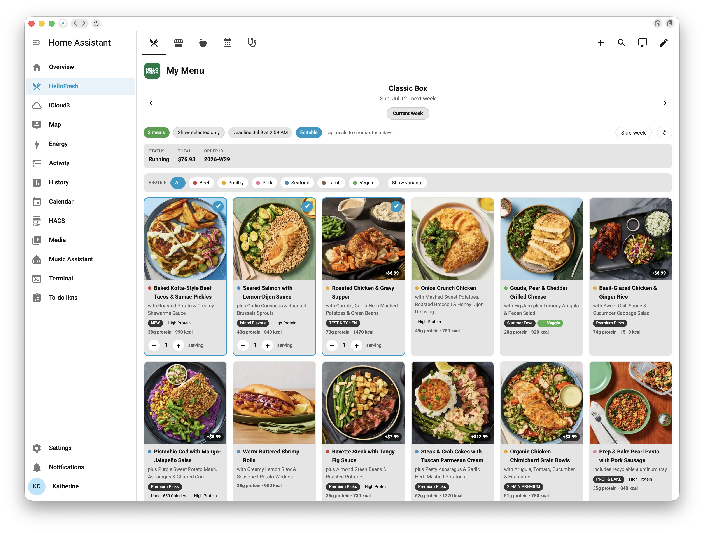
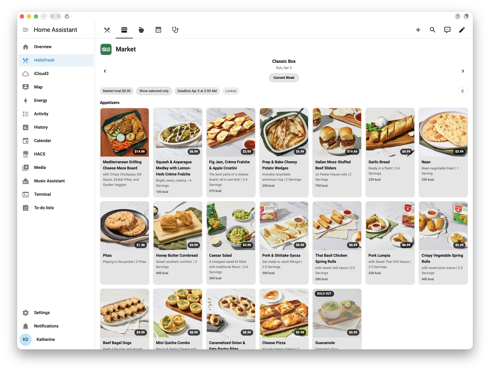

# HelloFresh Integration for Home Assistant

A custom Home Assistant integration that reads your HelloFresh account and menu data so you can track upcoming deliveries, shipment status, recipe selection deadlines, and week-by-week meal planning — and browse and edit your meals and HelloFresh Market add-ons — directly from Home Assistant.

It also exposes delivery-history summaries, shipment tracking metadata, billing/payment dates, and authenticated menu and profile details when those endpoints are available for your region and account.

> ⚠️ This is an **unofficial** integration, reverse-engineered from the HelloFresh website. It is not affiliated with or endorsed by HelloFresh, and the underlying API may change at any time.


[](https://github.com/kedube/ha-hellofresh/actions/workflows/ci.yml)
[](https://hacs.xyz/)

## Contents

- [Installation](#installation)
- [Configuration](#configuration)
  - [Supported regions](#supported-regions)
- [What It Provides](#what-it-provides)
- [HelloFresh Dashboard](#hellofresh-dashboard)
  - [Meal planner card](#meal-planner-card)
  - [Market card](#market-card)
  - [Recorder attribute sizes](#recorder-attribute-sizes)
- [Current Scope](#current-scope)
- [Troubleshooting](#troubleshooting)
- [Diagnostics](#diagnostics)
- [Development](#development)
- [References](#references)

## Installation

> Home Assistant requirement:
>
> - Home Assistant Core with support for config flows, diagnostics, and custom integrations

### Method 1: HACS custom repository

1. In Home Assistant, open **HACS**.
2. Open the menu in the top-right corner (**⋮**) and select **Custom repositories**.
3. Paste this repository's URL: `https://github.com/kedube/ha-hellofresh`
4. Set the category to **Integration** and click **Add**.
5. Search for **HelloFresh** in HACS, open it, and click **Download**.
6. Restart Home Assistant.

After restart, add the integration from Home Assistant:

[](https://my.home-assistant.io/redirect/config_flow_start/?domain=hellofresh)

### Method 2: Manual installation

1. Copy `custom_components/hellofresh` into your Home Assistant `config/custom_components` directory.
2. Restart Home Assistant.
3. Add the integration from **Settings > Devices & services > Add integration**.

[](https://my.home-assistant.io/redirect/config_flow_start/?domain=hellofresh)

## Configuration

HelloFresh has no official API or OAuth app. Setup offers **two ways** to connect, chosen from a menu when you add the integration:

- **Email and password (recommended)** — the integration logs in the same way the website does, obtaining a short-lived access token plus a long-lived refresh token, then keeps the connection refreshed automatically. No developer tools or token copying required.
- **Access token (advanced backup)** — paste your HelloFresh `apiV2Auth` token from a logged-in browser session. Use this only if email/password sign-in is blocked for you (see [Troubleshooting](#troubleshooting)). It works until the token expires (~60 days), then prompts you for a fresh one.

### Setting up (email and password — recommended)

1. Add the integration (see [Installation](#installation)).
2. Choose **Email and password (recommended)**.
3. Choose your **Country** (see [Supported regions](#supported-regions)).
4. Enter the **email** and **password** you use to sign in to HelloFresh.
5. Submit. Home Assistant signs in, validates the account, and stores the resulting tokens so it can refresh access on its own.

> 🔒 **About your credentials.** Your email and password are stored in the Home Assistant config entry and used only to log in to HelloFresh's own login endpoint and to re-authenticate when the refresh token eventually expires. They are redacted from diagnostics exports. As with any third-party integration, the security of your credentials depends on the security of your Home Assistant installation.

### Setting up (access token — advanced backup)

Use this only when email/password sign-in is blocked. The setup dialog includes step-by-step directions; in short:

1. Add the integration and choose **Access token (advanced)**, then your **Country**.
2. In a desktop browser, sign in to your regional HelloFresh website so you reach your account page.
3. Open developer tools (right-click → **Inspect**, or **F12**), open the cookies view (**Chrome/Edge:** Application → Cookies; **Firefox:** Storage → Cookies), select your HelloFresh site, and copy the **Value** of the **`apiV2Auth`** cookie.
4. Paste it into the token field and submit. A full `apiV2Auth` value includes the refresh token for the longest-lasting connection; a bare access token also works but is shorter-lived.

> ⚠️ A token-only entry **cannot self-heal**: when the refresh token expires (~60 days) or HelloFresh rotates it, there are no stored credentials to log back in, so Home Assistant raises a reauthentication prompt asking for a new token. Prefer email/password whenever it works.

### Why bot protection can matter

HelloFresh fronts its sites with Cloudflare. To pass that layer the integration presents as a real **Google Chrome on Windows 11** browser, including a genuine Chrome TLS/HTTP-2 fingerprint via the bundled `curl_cffi` dependency (installed automatically). Most regions accept this; a region with stricter bot-management rules may still block automated sign-in, which is what the access-token backup path is for.

### Reauthentication

The integration renews the short-lived access token automatically using the long-lived refresh token. For **email/password** entries it falls back to a full login with your stored credentials when the refresh token is rejected or expired; if that login fails (for example you changed your password), Home Assistant prompts you to re-enter your email and password. For **token-only** entries there are no stored credentials, so reauthentication instead asks you to paste a fresh `apiV2Auth` token.

### Options

These settings are adjusted *after* setup, in the integration's **Configure** dialog — separate from the initial connect flow. To open it:

1. Go to **Settings → Devices & Services**.
2. On the **Integrations** tab, find the **HelloFresh** card (or click the badge below to jump straight there).
3. Click **Configure** on the HelloFresh entry. (If you have multiple HelloFresh accounts, each entry has its own **Configure** with independent options.)
4. Adjust the fields described below and click **Submit**.

[](https://my.home-assistant.io/redirect/integration/?domain=hellofresh)

> 💡 **Configure vs. Add.** Use **Configure** (the button on an *existing* entry) to change these options. The **Add integration** flow is only for connecting a new account, and changes here take effect without re-entering your credentials.

The available options are:

- **Refresh interval (minutes)** — how often account data is polled. Default is **180**; allowed range is **5–1440**. (This is the data-refresh cadence; the bearer token is refreshed on its own faster-running schedule regardless of this value.)
- **Use public menu fallback** — when authenticated menu data is unavailable, scrape the public regional menu page so recipe data still appears.
- **Weeks of past history to load** — how many weeks of past deliveries to fetch and make browsable in the cards. Default is **26** (about 6 months); allowed range is **1–104**. Lower it to reduce how much data is pulled each refresh if you don't need a long history; raise it to browse further back (use **~56** for a full year, so the box from ~12 months ago is included). Changing it reloads the integration.

### Supported regions

Choose the matching country during setup:

| Region | Code | Website | Status |
| --- | --- | --- | --- |
| United States | `us` | https://www.hellofresh.com | ✅ |
| Canada | `ca` | https://www.hellofresh.ca | Untested |
| United Kingdom | `uk` | https://www.hellofresh.co.uk | ✅ |  
| Australia | `au` | https://www.hellofresh.com.au | Untested |
| Germany | `de` | https://www.hellofresh.de | Untested |
| Netherlands | `nl` | https://www.hellofresh.nl | Untested |

## What It Provides

### Entities

#### Sensors

Sensors are grouped below by purpose. The **Name** column is the friendly label shown in Home Assistant; the **Entity** column is the entity ID suffix. Most expose extra detail (full order, week, subscription, and tracking objects) as entity attributes.

A few conventions used in the tables:

- **Entity ID prefix.** Because entities use `has_entity_name`, the real IDs are prefixed from your config-entry title — a "HelloFresh (US)" account produces `sensor.hellofresh_us_next_delivery_date`, etc. The tables show the suffix only; substitute your own prefix.
- **Device class.** Where noted (`Date`, `Timestamp`, monetary), Home Assistant formats and graphs the value accordingly. Sensors without a noted device class are plain strings or numbers.
- **`None` / unavailable.** Many sensors report `None` (shown as *Unknown* in the UI) when the underlying field isn't set for your account or region — e.g. no holiday shift, no coupon, no tracked shipment. This is normal, not an error.
- **Attributes vs. state.** The state is the single headline value; richer context (the full week, order, subscription, or tracking object) is exposed as entity **attributes**. Full per-week recipe lists are deliberately kept out of attributes (recorder size limit) and are read on demand via `hellofresh.get_weeks` — see [Recorder attribute sizes](#recorder-attribute-sizes).

**Deliveries & orders**

| Name | Entity | Description |
| --- | --- | --- |
| Next delivery date | `sensor.next_delivery_date` | Delivery date of the subscription's next delivery (API `nextDelivery`). `Date` device class. |
| Next delivery week | `sensor.next_delivery_week` | **ISO week identifier** of the next delivery (e.g. `2026-W25`), from the API `nextDeliveryWeek` and normalized against the delivery date. A week label, deliberately distinct from `Next delivery date`. Plain string (no device class). |
| Next selectable delivery date | `sensor.next_selectable_delivery_date` | Date of the next delivery the customer can still modify (API `nextModifiableDeliveryDate`) — typically the week after the next delivery. `Date` device class. |
| Next selectable delivery week | `sensor.next_selectable_delivery_week` | **ISO week identifier** of the next modifiable delivery (API `nextModifiableDeliveryWeek`). Plain string (no device class). |
| Delivery Window | `sensor.next_delivery_slot` | Delivery time-slot label for the next order (e.g. `Mondays: 8AM - 8PM`); `None` when no preferred window is set. |
| Upcoming delivery count | `sensor.upcoming_delivery_count` | Number of non-skipped deliveries with a delivery date today or later. |
| Next delivery count | `sensor.delivery_count_this_week` | Number of deliveries scheduled within the current calendar week (Mon–Sun). |
| Next delivery blocked | `sensor.next_delivery_blocked` | `True`/`False` flag for whether HelloFresh has blocked delivery for the next configurable week (e.g. unavailable in your area that week). |
| Holiday delivery date | `sensor.next_holiday_delivery_date` | Rescheduled delivery date when the next week's box is shifted for a holiday; `None` when no holiday shift applies. `Date` device class. |
| Holiday delivery message | `sensor.next_holiday_message` | HelloFresh's holiday-shift notice for the next week (e.g. why the date moved); `None` when no holiday message is present. |

**Meal selection**

| Name | Entity | Description |
| --- | --- | --- |
| Weeks preselected by HelloFresh | `sensor.weeks_needing_selection` | Count of upcoming weeks whose meals HelloFresh **auto-picked** (preselected) for you rather than you choosing them — the weeks worth reviewing before the cutoff. Attributes (`weeks`) list each one. (The entity ID keeps the older `weeks_needing_selection` suffix for backward compatibility.) |
| Next delivery selection deadline | `sensor.next_selection_deadline` | Cutoff timestamp for the **next delivery** week (that week's `cutoffDate`, falling back to the subscription's `nextCutoffDate`) — the "Edit delivery by …" deadline. `Timestamp` device class. |
| Next selectable delivery selection deadline | `sensor.next_selectable_delivery_selection_deadline` | Cutoff timestamp for the **next modifiable** delivery week (`nextModifiableDeliveryWeek`'s `cutoffDate`) — the soonest box the customer can still change. `Timestamp` device class. |
| Next delivery meal count | `sensor.selected_meal_count` | Meals already chosen for the next pending/configurable week; `0` when none is pending. Excludes add-on and market items. |
| Next selectable delivery meal count | `sensor.next_selectable_delivery_meal_count` | Meals already chosen for the next modifiable delivery week (`nextModifiableDeliveryWeek`); `0` when no modifiable week is resolved. |
| Next delivery market count | `sensor.selected_market_count` | Number of distinct HelloFresh Market add-ons (extras) selected for the next configurable week; `0` when none. Counts market items only — meals are counted by *Next delivery meal count*. |
| Next selectable delivery market count | `sensor.next_selectable_delivery_market_count` | Number of distinct HelloFresh Market add-ons selected for the next modifiable delivery week; `0` when none or no modifiable week is resolved. |
| Next delivery preselected | `sensor.next_delivery_preselected` | `True`/`False` for whether HelloFresh **auto-picked** the meals for the next configurable week (the week's `mealsPreselected` flag) rather than you choosing them; `None` when no configurable week is resolved. A `True` here is the per-week signal behind *Weeks preselected by HelloFresh*. |
| Next selectable delivery preselected | `sensor.next_selectable_delivery_preselected` | `True`/`False` for whether HelloFresh auto-picked the meals for the next modifiable delivery week; `None` when no modifiable week is resolved. |
| Number of meals | `sensor.required_meal_count` | Meals that must be selected for the next pending week; falls back to the subscription's plan count when the week doesn't specify one. |

**Billing & payments**

| Name | Entity | Description |
| --- | --- | --- |
| Next delivery total price | `sensor.next_box_total_price` | Sum of all charges for the next upcoming delivery date, across every billing item for that date. Monetary device class; the unit reflects the subscription currency. |
| Account credit | `sensor.account_credit` | Spendable account credit that applies automatically to the next order (API `/gw/payments/customers/{uuid}/balance` → `amount`). Monetary device class; unit from `currencyCode`. |
| Selected plan total price | `sensor.selected_plan_total_price` | Standing weekly plan price **including shipping** (the `grandTotal` from a recurring `/gw/calculate` for the primary subscription) — the price shown in plan settings, distinct from the next box's actual charge. Monetary device class; unit reflects the subscription currency. |
| Recent payment date | `sensor.recent_payment_date` | Date of the most recent HelloFresh charge that has **already been billed** (the order's `createdAt`), from order history. Because HelloFresh bills a box a few days before it ships, this reflects your last actual charge even when that box's delivery is still upcoming. Charges dated in the future are ignored. `Date` device class. |
| Next delivery payment date | `sensor.next_payment_date` | Estimated date of the next charge — the upcoming order's delivery date, falling back to the subscription's next cutoff date. `Date` device class. |
| Next delivery order ID | `sensor.recent_order_id` | Order number for the next upcoming delivery, as shown in the HelloFresh UI (the `orderNr` field). |
| Next delivery coupon | `sensor.next_box_coupon` | Active promo/coupon code applied to the primary subscription; `None` when no coupon is on file. |

**Account & subscription**

| Name | Entity | Description |
| --- | --- | --- |
| Selected plan | `sensor.selected_plan` | Plan name from the primary subscription (e.g. `Meat & Veggies`); shows the display name when a specific plan name isn't returned. |
| Number of people | `sensor.number_of_people` | Servings-per-box setting from the primary subscription (e.g. `2`). |
| Account subscription count | `sensor.subscription_count` | Number of subscriptions on the account. Most sensors report on the primary (first) subscription only, so a value above 1 means additional subscriptions aren't individually surfaced. |
| Subscription status | `sensor.subscription_status` | Plan-level status of the primary subscription (e.g. `active`, `paused`), lowercased from the API. This is the whole-plan state, distinct from per-week skip state; `None` when the account doesn't report it. |
| Delivery address | `sensor.delivery_address` | Single-line delivery address from the primary subscription; redacted in diagnostics exports. |
| Account ID | `sensor.account_id` | HelloFresh customer account ID. |
| Boxes received | `sensor.boxes_received` | Lifetime count of boxes delivered to the account, from the authenticated profile endpoint. |
| Available menu recipe count | `sensor.public_menu_recipe_count` | Number of recipes on the current week's public menu; `0` when menu data is unavailable. |

**Shipment tracking**

| Name | Entity | Description |
| --- | --- | --- |
| Tracked shipment status | `sensor.shipment_tracking_status` | Carrier tracking status of the best-tracked shipment (in transit, out for delivery, delivered, exception), from the SCM tracking feed. The icon reflects the state; `None` when no tracked shipment exists. |
| Next delivery status | `sensor.next_order_status` | Box lifecycle status of the next delivery (e.g. `preparing`, `running`, `on_the_way`, `delivered`). The icon reflects the current state. |
| Tracked shipment number | `sensor.shipment_tracking_number` | Parcel/tracking number for the tracked shipment; shares attributes with the tracking-status sensor. |
| Tracked shipment carrier | `sensor.tracked_shipment_carrier` | Carrier for the tracked shipment (e.g. `UPS`, `FedEx`, `DoorDash`); `None` when no tracking data is present. |
| Tracked shipment URL | `sensor.next_delivery_tracking_url` | Direct carrier tracking link for the best-tracked order; `None` when no link is available. |

**History & skipped weeks**

| Name | Entity | Description |
| --- | --- | --- |
| Last delivery date | `sensor.last_delivery_date` | Delivery date of the most recently completed week from delivery history. `Date` device class. |
| Skipped week count | `sensor.skipped_week_count` | Number of upcoming weeks marked as skipped. |
| Next skipped week | `sensor.next_skipped_week` | Display name of the nearest upcoming skipped week (e.g. `2026-W24`); `None` when none are skipped. |

**Diagnostic** (shown under the device's *Diagnostic* section)

| Name | Entity | Description |
| --- | --- | --- |
| Account delivery subscription ID | `sensor.next_delivery_subscription` | Internal HelloFresh subscription ID for the next order. Diagnostic. |
| Access token time remaining | `sensor.access_token_minutes_remaining` | Whole minutes until the current access token expires (unit `min`). Access tokens are short-lived (~30 min) and auto-refreshed. Attributes expose the exact `expires_at` timestamp and `seconds_remaining`. Diagnostic. |
| Refresh token time remaining | `sensor.refresh_token_days_remaining` | Whole days until the refresh token expires (unit `d`). When the refresh token expires the integration logs in again with your stored credentials; if that login fails you are prompted to reauthenticate. Attributes expose the exact `expires_at` timestamp and `seconds_remaining`. Diagnostic. |
| API base URL | `sensor.api_base_url` | Regional API base URL the integration is using. Diagnostic. |

#### Binary sensors

| Entity | Notes |
| --- | --- |
| `binary_sensor.needs_meal_selection` | `True` when at least one upcoming delivery week still requires meal selection; the primary signal for reminder automations |
| `binary_sensor.write_actions_available` | `True` when the account advertises at least one supported write action (meal selection, skip/unskip, reschedule, delivery-weekday change, etc.); diagnostic entity |
| `binary_sensor.tracked_shipment_available` | `True` when the most-recent order has active shipment tracking data (carrier, tracking number, or tracking URL) |
| `binary_sensor.payload_shape_changed` | `True` when HelloFresh returned authenticated data that the integration could not fully parse; signals that an API update may require integration changes; a matching Repairs issue is also raised; diagnostic entity |

#### Other

| Entity | Notes |
| --- | --- |
| `calendar.delivery_schedule` | Calendar entity showing all upcoming and recent HelloFresh deliveries as calendar events; each event title includes the delivery week and order status |
| `button.refresh_data` | Triggers an immediate coordinator refresh outside the normal polling interval |
| `switch.skip_next_modifiable_week` | Shown as **Skip next selectable delivery week**. On = skip the next modifiable delivery week (no box ships); off = restore it. State reflects whether that week is currently skipped. |

Order, week, menu, subscription, capability, and tracking details are exposed as entity attributes, and authenticated history endpoints feed recent delivered-week context into the delivery-history sensors' attributes. Full per-week recipe lists are intentionally **not** included in attributes (to stay under the recorder's size limit — see [Recorder attribute sizes](#recorder-attribute-sizes)); they remain available in the diagnostics export.

Several entity IDs differ from their displayed names — for example `sensor.required_meal_count` shows as **Number of meals**, `sensor.weeks_needing_selection` as **Weeks preselected by HelloFresh** (the ID kept its original suffix when the sensor was repurposed), `sensor.public_menu_recipe_count` as **Available menu recipe count**, `sensor.recent_order_id` as **Next delivery order ID**, `sensor.next_delivery_slot` as **Delivery Window**, `sensor.selected_meal_count` as **Next delivery meal count**, `sensor.selected_market_count` as **Next delivery market count**, `sensor.delivery_count_this_week` as **Next delivery count**, `sensor.next_order_status` as **Next delivery status**, `sensor.shipment_tracking_status` as **Tracked shipment status**, and `switch.skip_next_modifiable_week` as **Skip next selectable delivery week** (see the Name columns above).

### Voice and Assist

The integration registers HelloFresh intent handlers for:

- next delivery status
- meal-selection status
- manual refresh

These handlers are intended for Home Assistant conversation workflows and future sentence matching support.

### Services

- `hellofresh.refresh_data` — refresh account data immediately, outside the normal polling interval
- `hellofresh.get_weeks` — **returns a response**: delivery weeks with full recipe, selection, market, and order detail (none of which are exposed as entity attributes). Each recipe carries its name, image, description, tags, nutrition, `is_selected`, `selected_quantity`, `course_index`, any surcharge, and the variant modifier (`variation_title`, e.g. "2x Bacon"); each week also includes its `market_items` (HelloFresh Market add-ons) and its matching `order` (tracking, status, carrier, billed total). Optionally filter to one `week_id`. Powers the [Meal planner card](#meal-planner-card) and [Market card](#market-card).
- `hellofresh.select_meals` — set the chosen recipes for a week (`week_id` + `recipe_ids`, with an optional `quantities` map of recipe id → servings for doubled portions); writes to the website's HAR-verified cart endpoint. Selecting more or fewer distinct meals than your plan resizes the box for that week (minimum 2 meals)
- `hellofresh.select_market_items` — set the HelloFresh Market add-on (extras) selection for a week (`week_id` + a `quantities` map of market item id/sku/index → quantity; 0 removes an item); writes the cart's `extras`, preserving the week's meal selection
- `hellofresh.skip_week` — skip a chosen delivery week so no box ships
- `hellofresh.unskip_week` — restore a previously skipped week
- `hellofresh.reschedule_week` — move a single week's delivery to a different delivery option (one-off)
- `hellofresh.change_delivery_weekday` — change the recurring delivery option/interval for a plan (affects all future deliveries)
- `hellofresh.get_food_profile` — **returns a response**: the customer's food profile (the preferences HelloFresh uses to auto-preselect meals) plus the full catalog of selectable options (taste exclusions, dietary preference, liked/disliked cuisines/proteins/flavors/dish-types, nutrition goals, meal types, household size, and goals). Read-only; fetched live from the profile-service. Powers the [Food Profile card](#food-profile-card).
- `hellofresh.set_food_profile` — update the food profile; provide any of `taste`, `household`, or `goals` (only the supplied sections change). Weighted taste fields accept either a list of liked slugs or a `{slug: +100/-100}` map. Returns the saved profile.

When multiple HelloFresh accounts are configured, service calls can target a specific entry with `config_entry_id`.

For an interactive alternative to calling these services by hand, the [Meal planner card](#meal-planner-card) drives `select_meals`, `skip_week`, and `unskip_week`, the [Market card](#market-card) drives `select_market_items`, and the [Food Profile card](#food-profile-card) drives `get_food_profile`/`set_food_profile`, all from the dashboard. The `switch.skip_next_modifiable_week` entity (**Skip next selectable delivery week**) also skips/restores the next modifiable week with a single toggle.

How write actions behave (skip/unskip and meal selection) is described under [Current Scope](#current-scope): the integration uses the website's verified write endpoints first and stops with a clear error — raising a Repairs issue — rather than guessing endlessly.

## HelloFresh Dashboard




A ready-to-use Lovelace dashboard is included at [`dashboard/hellofresh.yaml`](dashboard/hellofresh.yaml), organized around how you actually use HelloFresh. It is **100% built-in Lovelace plus the integration's two packaged cards** — no HACS frontend add-ons required. Its four views:

- **My Menu** — the packaged [Meal planner card](#meal-planner-card) (below), shown full width (`panel: true`): browse every week's full menu with images, see your selected meals highlighted, change the selection and per-meal serving quantity on editable weeks, and skip/unskip — all reading per-week recipes on demand via `hellofresh.get_weeks`. A per-week strip at the top shows that week's order (tracking, status, carrier, billed total).
- **Market** — the packaged [Market card](#market-card): browse and order HelloFresh Market add-ons (appetizers, sides, desserts, proteins, …) per week, grouped by category, with prices and a quantity stepper per item.
- **Food Profile** — the packaged [Food Profile card](#food-profile-card): view and edit every preference HelloFresh uses to auto-preselect your meals — taste exclusions, dietary preference, liked/disliked cuisines, proteins, flavors and dish types, nutrition goals, meal types, household size, and goals.
- **Schedule** — the packaged [Schedule card](#schedule-card): a clean "next box" summary (delivery date, deadline countdown, status and price) and a timeline of upcoming weeks with their selection state, above the delivery calendar, a holiday-delivery banner (conditional), and a foldable "Subscription details" list with the full per-box metrics.
- **Diagnostics** — token-expiry and integration-health entities plus a refresh action, tucked out of the way.

### Meal planner card

The integration ships a custom Lovelace card, **`custom:hellofresh-meal-planner-card`**, for browsing your delivery weeks recipe-by-recipe with images and changing the selection on weeks that are still editable. It reads full per-week recipe detail on demand from the response-returning `hellofresh.get_weeks` service (recipes aren't exposed as entity attributes, to stay under the recorder's size limit), so it shows the complete menu with images, your current picks highlighted, calories, and per-protein tags — none of which fit in a sensor attribute.

The card is served and registered automatically when the integration loads (no manual resource step in storage-mode dashboards). Add it to any dashboard:

```yaml
type: custom:hellofresh-meal-planner-card
# title: HelloFresh Meal Planner   # optional header
# image_width: 400                 # optional recipe-image width
# config_entry_id: <id>            # required only with multiple HelloFresh accounts
```

What it does:

- **Week cursor** (‹ ›) across past, current, and upcoming weeks, opening on the next still-editable week.
- **Recipe grid** with lazy-loaded images (resized via HelloFresh's Cloudinary transform), a protein-color dot, description, and calories. Your chosen meals are highlighted with a ✓, and the per-week **meal count** is shown alongside your plan's meal count (e.g. `2 meals (plan: 3)` when you've resized the week). The grid is **sorted** so your selected meals lead, and the remaining menu is grouped by dish so a meal's variants sit together. For **past** weeks the ✓ reflects the meals that were *actually delivered* (sourced from delivery history, not the menu's auto-fill), and **paused** weeks correctly show no selection since nothing shipped. A full calendar year of past boxes is browsable.
- **Variant differentiation** — when HelloFresh lists the same dish in several forms, the tile calls out exactly what differs: the modifier (e.g. "2x Bacon", "Gluten-Free Linguine"), any per-serving surcharge, and protein/calorie deltas. The plain, unmodified option in such a set is labeled **Default**. Genuinely identical duplicate listings are collapsed into a single tile.
- **Edit, quantity & save** on editable weeks (when `allowed_actions.mealSwap` is true and the selection deadline hasn't passed): tap recipes to build a pending selection, use the **− N +** stepper to set per-meal servings (a doubled portion fills two box slots), then **Save selection** submits it via `hellofresh.select_meals` and re-reads to confirm (**Cancel** discards the edit). You can choose **more or fewer** distinct meals than your plan — the box **resizes** for that week (and HelloFresh reprices it accordingly), down to a minimum of **2 meals**. While the selection saves, a "Please wait while saving selections…" banner is shown, and afterward the card stays on the week you edited. Locked/past weeks render read-only.
- **Order strip** at the top of each week showing that week's order detail (status, carrier, tracking number/link, billed total, order ID), falling back to the standing plan price for weeks not yet billed.
- **Meal filters** (current & upcoming weeks) — a filter bar to narrow the menu by **protein** (Beef, Poultry, Pork, Seafood, Lamb, Veggie — tap any combination, or **All** to clear) and to **hide variants** so only the *Default* meal of each dish shows (the 2× protein, protein-swap and veggie-swap versions are collapsed away). Your currently selected meals always stay visible regardless of the filter. Choices are remembered across weeks and reloads; the bar is hidden on past weeks (which just show what was delivered).
- **Filter toggle** to show only selected meals or all meals (the choice is remembered across weeks and reloads), **skip / unskip** the displayed week, a refresh button, and a banner summarizing any weeks that still need a selection (tap it to jump to the first one).

> Meal-selection writes are confirmed on the US site; other regions fall back to best-effort guesses (see [Current Scope](#current-scope)). Browsing works everywhere the menu loads.

If your dashboard is in **YAML mode** (resources are user-managed), add the resource once under **Settings → Dashboards → Resources** as a *JavaScript module* pointing at `/hellofresh/hellofresh-meal-planner-card.js`.

The Schedule view's per-week "weeks needing selection" breakdown reads directly from an entity **attribute** (the `weeks` list on the selection-deadline sensor) — data the headline state alone doesn't show.

To use it:

1. Open **Settings → Dashboards → ⋮ → Edit in YAML** (or add a new YAML-mode dashboard) and paste the file's contents.
2. Update the entity-ID prefix. Because entities use `has_entity_name`, their IDs derive from your config-entry title — a "HelloFresh (US)" account produces IDs like `sensor.hellofresh_us_next_delivery_date`. The example uses the `hellofresh_us_` prefix throughout; **find-and-replace it** with the prefix your account actually uses (check **Settings → Devices & Services → HelloFresh → entities** for the real IDs).

### Market card

The integration also ships **`custom:hellofresh-market-card`**, for browsing and ordering HelloFresh Market add-ons (the extras you can add to a box: appetizers, breakfast, desserts, proteins, sides, and more) week by week. Like the meal-planner card it reads on demand from `hellofresh.get_weeks` (market items aren't exposed as entity attributes) and writes via `hellofresh.select_market_items`. It is auto-registered the same way; in YAML-mode dashboards add `/hellofresh/hellofresh-market-card.js` as a *JavaScript module* resource.

```yaml
type: custom:hellofresh-market-card
# title: HelloFresh Market   # optional header
# logo: true                 # optional bundled HelloFresh logo in the header
# image_width: 400           # optional item-image width
# config_entry_id: <id>      # required only with multiple HelloFresh accounts
```

What it does:

- **Week cursor** (‹ ›) across weeks that have a market catalog.
- **Items grouped by category** (Appetizers, Proteins, Desserts, …), each tile showing the image, name, price, and calories. Sold-out items are dimmed and badged.
- **Quantity steppers** — set how many of each item to order with a **− N +** control (clamped to the item's max), with a live **Market total** of the selection. **Save selection** writes it via `hellofresh.select_market_items` (which preserves your meal selection, including a week you've resized to fewer/more meals); a "Please wait while saving selections…" banner shows during the write and the card stays on the week you edited. **Cancel** discards the edit. A **show selected only** filter (remembered across weeks and reloads) hides the rest.

> Market reading and writing are HAR-verified against the live US cart API (selection state, single- and multi-item writes, and meal preservation). The cart's `extras` payload is grouped by item SKU and split into recurring vs. this-week (one-off) quantities, matching the website.

### Food Profile card

The integration also ships **`custom:hellofresh-food-profile-card`**, for viewing and editing your **food profile** — the preferences HelloFresh uses to automatically pre-select meals for upcoming weeks. It reads the profile and the full catalog of options live from `hellofresh.get_food_profile` (the profile isn't part of the regular sensor poll) and saves via `hellofresh.set_food_profile`. It is auto-registered the same way; in YAML-mode dashboards add `/hellofresh/hellofresh-food-profile-card.js` as a *JavaScript module* resource.

```yaml
type: custom:hellofresh-food-profile-card
# title: Food Profile        # optional header
# logo: true                 # optional bundled HelloFresh logo in the header
# config_entry_id: <id>      # required only with multiple HelloFresh accounts
```

What it does, driven entirely by the options catalog so new HelloFresh options appear automatically:

- **Dietary preference** — single-select (flexitarian, mostly-meat, vegetarian, pescatarian).
- **Multi-select chips** — taste exclusions (with a "None" choice where HelloFresh allows it), nutrition goals, meal types, and goals.
- **Like / Dislike** — a tri-state 👍/👎 toggle per item for cuisines, flavors, dish types, and proteins (👍 = +100, 👎 = −100, neither = neutral), exactly matching how HelloFresh weights them.
- **Household** — adults / children selectors.
- **Save / Reset** — Save writes only the changed sections via `hellofresh.set_food_profile`; Reset reverts the draft to the server's current profile. The Save button is enabled only when there are unsaved changes.

> The profile read/write shapes (the `taste` / `household` / `goals` sections, the weighted +100/−100 maps, and the PATCH payload) are HAR-verified against the live US profile-service API.

### Schedule card

The integration also ships **`custom:hellofresh-schedule-card`**, a clean overview of your delivery schedule. Like the other cards it reads per-week data on demand from `hellofresh.get_weeks` (one call builds the whole view) and is auto-registered the same way; in YAML-mode dashboards add `/hellofresh/hellofresh-schedule-card.js` as a *JavaScript module* resource.

```yaml
type: custom:hellofresh-schedule-card
# title: Schedule           # optional header
# logo: true                # optional bundled HelloFresh logo in the header
# max_weeks: 8              # optional cap on timeline rows (default 8)
# config_entry_id: <id>     # required only with multiple HelloFresh accounts
```

What it does:

- **Next-box summary** — the nearest upcoming delivery's date (with a relative "in 3 days"), the selection-deadline countdown (highlighted red when under 24h), and the order status with the box total.
- **Timeline** — a chronological row per upcoming week with a status dot, date, week label, a one-line detail (meals chosen, "Pick N meals" with the time left, or "No box this week"), and a state badge. The current box is highlighted; **Set** / **Needs picking** / **Skipped** / **Delivered** states are colour-coded.
- It's read-only; edit selections from the [Meal planner card](#meal-planner-card).

### Recorder attribute sizes

Sensor state attributes are kept small so the recorder stores them without hitting Home Assistant's 16 KB per-state attribute limit. The full recipe catalog for a week (which can be large once the authenticated menu loads) is intentionally **not** embedded in any sensor attribute — the per-week `weeks` list on `sensor.hellofresh_us_next_selection_deadline` and the single-week context objects on other sensors carry only scalar week metadata (dates, deadline, meal counts, slot). No recorder `exclude` configuration is required. When you do need per-week recipes (names, selection state, images), call the read-only `hellofresh.get_weeks` service, which returns them on demand without touching the recorder.

The complete recipe and market data is still available where it matters: the `hellofresh.select_meals` and `hellofresh.select_market_items` services read it from the live integration state, and a full serialization (with recipes) is included in the redacted **diagnostics** export for debugging.

## Current Scope

What works:

- email/password login through the HelloFresh `/gw` auth gateway, with automatic access-token refresh and credential-based re-login
- an alternative token-only setup path (paste an `apiV2Auth` token) as a backup when login is blocked, valid until the refresh token expires
- a real Chrome-on-Windows-11 browser fingerprint (Client Hints plus a genuine TLS/HTTP-2 fingerprint via `curl_cffi`) to pass Cloudflare bot protection on the auth and data requests
- token validation against `/gw/api/customers/me/subscriptions`
- account delivery and order parsing from verified or likely `/gw/...` delivery endpoints
- aggregation across multiple subscriptions on the same HelloFresh account
- account profile metrics such as delivered box counts when exposed by authenticated profile endpoints
- delivered-week history summaries from authenticated past-delivery endpoints, covering a full calendar year of past boxes
- richer recipe parsing including nutrition, image, tag, and per-recipe selection metadata from the authenticated menu, with `course_index` for round-tripping selections
- per-week meal-selection state (which recipes you've chosen) that reflects your actual picks: for current/upcoming weeks from the authenticated menu's cart quantities, and for **past** weeks from the meals that were actually delivered (so old weeks aren't shown with the system's auto-fill placeholders, and paused weeks correctly show no selection)
- authenticated menu API attempts before falling back to public HTML scraping
- shipment tracking extraction and SCM enrichment when the payload includes carrier, parcel, or HelloFresh tracking-page details
- public menu scraping from the regional `/menus` page
- reminders driven by `binary_sensor.needs_meal_selection`
- delivery calendar plus selection-deadline timestamp sensors for both the next delivery and the next selectable (modifiable) delivery
- account credit balance from the payments balance endpoint
- meal selection (with per-meal serving quantity) via `select_meals`, using the website's HAR-verified cart endpoint (`PUT /gw/v1/carts/{week}`) as the primary path, with guessed fallbacks only if the cart request can't be built. Choosing more or fewer distinct meals than the base plan resizes the box for that week (the cart's `product-sku` meal digit is adjusted up or down, matching the web app), with a minimum of 2 meals
- HelloFresh Market add-on (extras) browsing and ordering via `select_market_items` — selection state, single- and multi-item writes, recurring-vs-one-off quantities, and meal preservation are all HAR-verified against the live US cart API
- per-week order detail (tracking, status, carrier, billed total) surfaced alongside each week, with the billed total computed the same way as the `next_box_total_price` sensor
- skipping/restoring the next modifiable delivery week from a switch, plus `skip_week` / `unskip_week` services that use the website's own write endpoints with conservative fallbacks
- on-demand per-week recipe, market, selection, and order detail via the response-returning `hellofresh.get_weeks` service (kept out of entity attributes to respect the recorder size limit)
- two packaged Lovelace cards — a [Meal planner card](#meal-planner-card) and a [Market card](#market-card) — for browsing weeks and editing selections/quantities, both auto-registered by the integration
- Repairs issues when the integration falls back to public menu data, sees unexpected payload shapes, or cannot verify a write action

What is not implemented yet:

- a first-party OAuth / account-linking flow (the integration logs in directly with your stored email and password, or reuses a pasted token, instead)
- verification of the write endpoints beyond the US site (the US meal-selection and skip/unskip requests are confirmed; other regions fall back to best-effort guesses)
- live push updates from HelloFresh, if an official push channel exists

Because HelloFresh does not publish a stable consumer integration contract here, write actions stay cautious: the integration uses the website's confirmed write endpoints first, tries a small set of fallbacks if those don't fit your account, and stops with a clear error rather than guessing endlessly.

## Troubleshooting

**The integration keeps asking me to reauthenticate.**
This means HelloFresh rejected a login with your stored credentials — most often because the account password changed, or HelloFresh required an extra verification step. Open the reauthentication prompt and enter your current HelloFresh email and password. Make sure you selected the **correct region** during setup, since each region is a separate HelloFresh login.

**Setup fails with "Invalid authentication."**
HelloFresh rejected the email/password. Double-check the credentials, confirm you can sign in to the **correct regional** HelloFresh website with them, and that you picked the matching **Country**.

**Setup fails with "Could not connect."**
Home Assistant could not reach HelloFresh, or the response wasn't understood. Check Home Assistant's network access and try again; transient site errors usually clear on a retry.

**The log shows "login BLOCKED by bot protection" (HTTP 403 with an HTML page).**
HelloFresh's website fronts its login with Cloudflare bot protection that sometimes blocks automated sign-ins. This is **not** a wrong-password problem — the request was rejected before it reached the login API, so re-entering your credentials won't help. The integration already presents a real Chrome TLS/HTTP-2 fingerprint (via the bundled `curl_cffi`) to get past this, and treats a block as temporary and retries on its next poll, so it usually clears on its own. If a region blocks email/password sign-in persistently, use the **access-token setup path** ([Setting up (access token)](#setting-up-access-token--advanced-backup)) as a backup — it bypasses the login step entirely by reusing a token from your own logged-in browser session. Confirm you can still log in to the HelloFresh website in a normal browser; a server-side block on your account or IP would need to clear regardless.

**Recipe details are missing or a "menu fallback" Repairs issue appears.**
The integration couldn't load structured menu data from the authenticated API and fell back to scraping the public menu page. Delivery tracking still works; recipe details may be less complete until the API payload is recognized again.

**A past week shows the wrong meals selected (or a paused week shows meals).**
For weeks that already shipped, the selection is taken from your **delivery history**, not the editable menu, because the menu reports the system's auto-fill picks for old weeks. A paused week shipped nothing, so it shows no selection. The integration browses a full calendar year of history; weeks older than that aren't available. If a recent past week still looks wrong, attach a [diagnostics export](#diagnostics) to a GitHub issue.

**A "payload shape changed" Repairs issue appears.**
HelloFresh returned account data the integration couldn't fully parse — usually a sign the website changed. Attaching a [diagnostics export](#diagnostics) to a GitHub issue is the most helpful thing you can do here.

## Diagnostics

This integration includes Home Assistant diagnostics support for config entries, with sensitive values redacted before export. Diagnostics include capability flags, subscription summaries, parsed order data, menu fallback state, delivery/tracking debug attempts, and the normalized serialized account views used by entities.

To download a diagnostics export: **Settings → Devices & services → HelloFresh → ⋮ (the three-dot menu) → Download diagnostics**. Tokens and personal details are redacted automatically, so it is safe to attach to a bug report.

### Debug logging

When troubleshooting (e.g. auth/refresh problems, parsing errors, or before filing an issue), enable debug logging for the integration so its activity is written to the Home Assistant log.

**Option 1 — no restart, temporary.** From **Settings → Devices & services → HelloFresh → ⋮ → Enable debug logging**. Reproduce the problem, then choose **Disable debug logging** to download the captured log. This is the quickest way and resets on the next restart.

**Option 2 — `configuration.yaml`, persistent.** Add a `logger:` block, then restart Home Assistant. The integration logs under the `custom_components.hellofresh` namespace:

```yaml
# configuration.yaml
logger:
  default: warning          # keep everything else quiet
  logs:
    custom_components.hellofresh: debug
```

Tips:

- To trace only the parts you care about, target a submodule instead of the whole package — e.g. `custom_components.hellofresh.client: debug` for the HTTP/auth calls, or `custom_components.hellofresh.normalizers: debug` for payload parsing.
- Debug output can include request paths and parameters (week ids, ranges, endpoints). It does **not** log your password, and access/refresh tokens are not written in full — but treat the log as sensitive and review it before sharing.
- After capturing what you need, remove the `logs:` entry (or set it back to `warning`) and restart, since `debug` is verbose.

Logs appear in **Settings → System → Logs** (and in `config/home-assistant.log`).

For lower-level endpoint details and normalization notes, see [HELLOFRESH_API.md](HELLOFRESH_API.md).

## Development

This repository is structured as a HACS-compatible custom integration repository:

- integration code under `custom_components/hellofresh`
- metadata in `custom_components/hellofresh/manifest.json`
- HACS metadata in `hacs.json`
- translations in `custom_components/hellofresh/translations/`
- local brand assets in `custom_components/hellofresh/brand/`

It also includes:

- a pytest suite for API normalization, serialization behavior, the email/password auth and token-refresh lifecycle, the token-only setup/transport paths, and richer capability helpers
- GitHub Actions workflows for HACS validation, `hassfest`, and `python -m pytest -q`
- issue templates for bug reports and feature requests
- a [contributing guide](CONTRIBUTING.md)
- a ready-to-use [example dashboard](dashboard/hellofresh.yaml) (see [HelloFresh Dashboard](#hellofresh-dashboard))
- a documented [quality-scale target](QUALITY_SCALE.md)

Recent local verification included:

- `python3 -m pytest -q`
- `python3 -m compileall custom_components/hellofresh`

## References

- Reverse-engineered example used to validate current auth and endpoint assumptions:
  - https://github.com/CNoetzel/HelloFresh-RecipeDownloader
  - https://raw.githubusercontent.com/CNoetzel/HelloFresh-RecipeDownloader/master/downloader.py
- HACS documentation:
  - https://hacs.xyz/docs/publish/integration/
- Home Assistant developer documentation:
  - https://developers.home-assistant.io/docs/creating_integration_manifest/
  - https://developers.home-assistant.io/docs/core/integration/config_flow/
  - https://developers.home-assistant.io/docs/internationalization/custom_integration/
