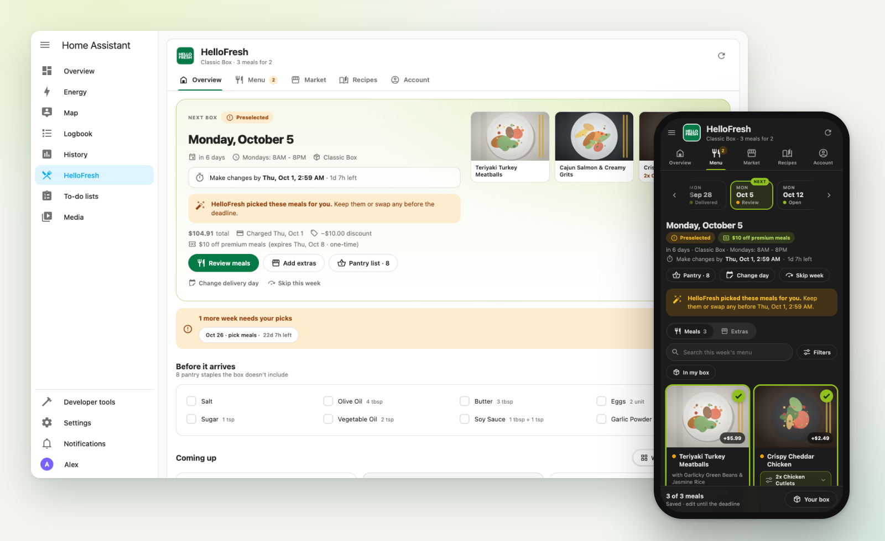
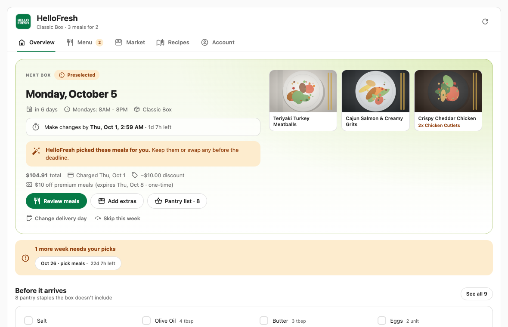
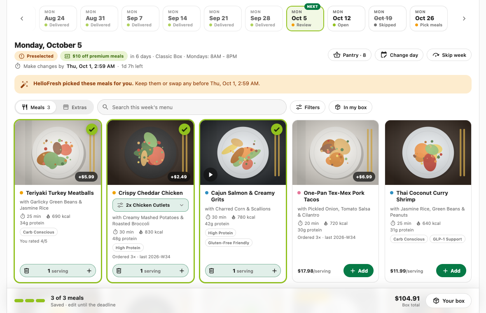
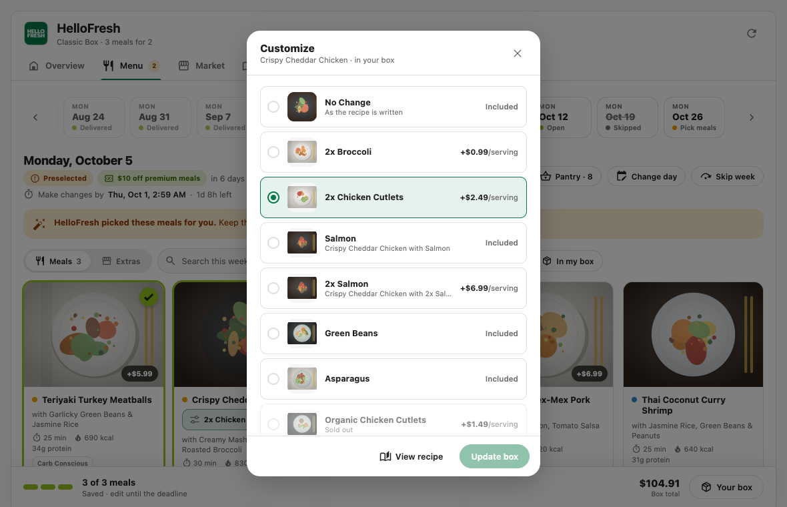
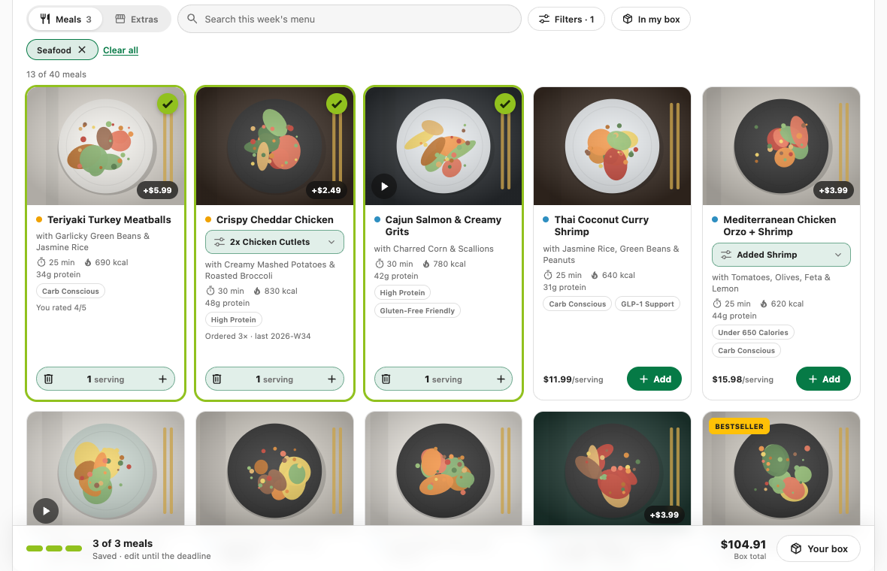
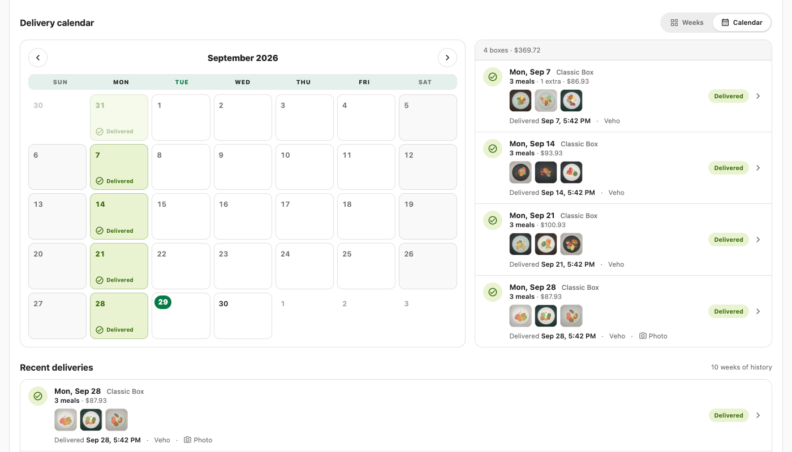
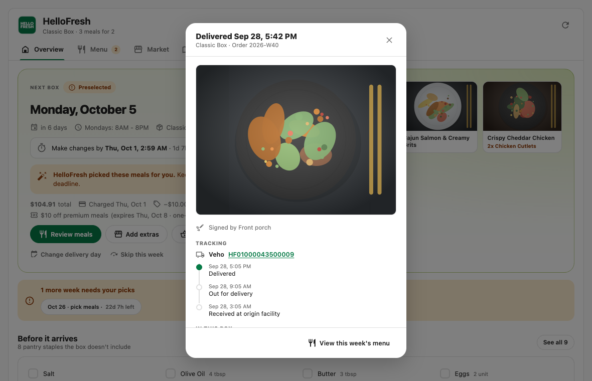
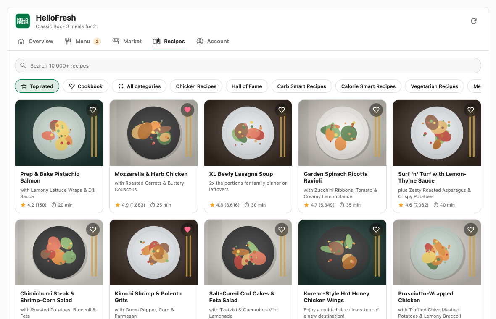
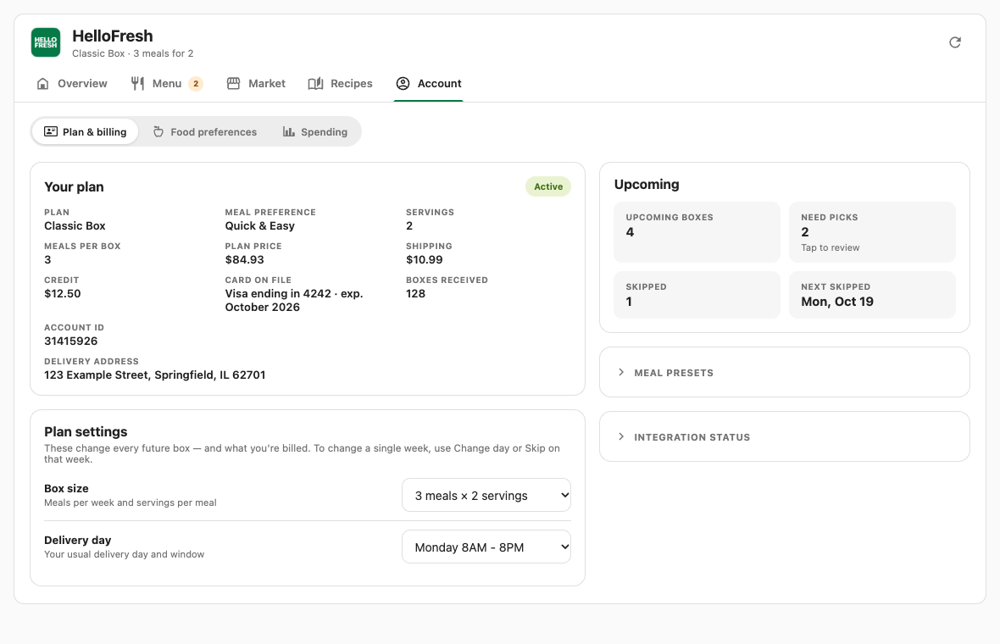
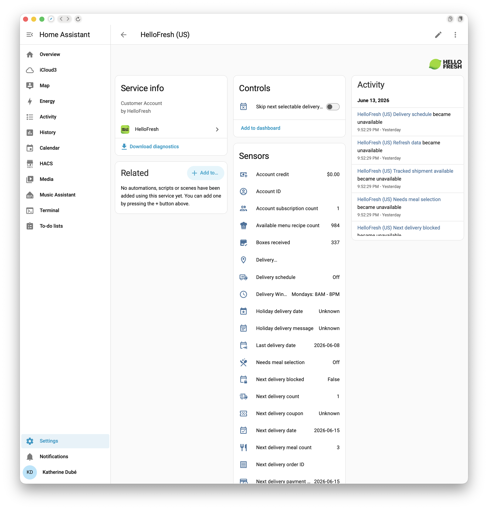

# (Unofficial) HelloFresh Integration for Home Assistant

[](https://github.com/kedube/ha-hellofresh/actions/workflows/ci.yml)
[](https://hacs.xyz/)

<p align="center">
  
</p>

Plan your HelloFresh boxes without leaving Home Assistant. Choose each week's meals (customized like
on the website) and Market extras and save them together, follow the next box to your door, tick
off the pantry staples it doesn't include, browse ~10,000 recipes, and manage your plan. It all
lives in one card that the integration adds to your **sidebar**, so there's no dashboard to build.
Behind it are **50+ entities**, a delivery calendar, pantry to-do lists and **26 services** for
your own automations.

> ⚠️ This is an **unofficial** integration, reverse-engineered from the HelloFresh website. It is not affiliated with or endorsed by HelloFresh, and the underlying API may change at any time.

## Highlights

<table>
  <tr>
    <td width="50%" valign="top">
      <br>
      <b>The next box, front and centre.</b> Its date, delivery window and a live countdown to the deadline, the meals in it, the bill and any discount, the carrier's tracking, and the pantry staples to buy first as a checklist.
    </td>
    <td width="50%" valign="top">
      <br>
      <b>Every week's menu, one box.</b> Step through your weeks, add meals and set servings, and add Market extras to the same box. A bar at the bottom prices it all with HelloFresh's own calculation and saves it in one tap.
    </td>
  </tr>
  <tr>
    <td width="50%" valign="top">
      <br>
      <b>Customize like the website.</b> One tile per dish. Its drawer lists every option (2× protein, a salmon swap, added bacon) with the ingredient's photo and surcharge, and switching keeps your servings.
    </td>
    <td width="50%" valign="top">
      <br>
      <b>The website's filters.</b> Protein, dietary preference, cuisine, dish type, ingredients to avoid and cooking time, answered by HelloFresh's own filter service. Under Seafood, a chicken dish shows up as its shrimp version.
    </td>
  </tr>
  <tr>
    <td width="50%" valign="top">
      <br>
      <b>Every delivery on a calendar.</b> A month of day tiles, each box in its state's colour, with the month's boxes and what they cost beside it. Skip a week or change its delivery day from any week.
    </td>
    <td width="50%" valign="top">
      <br>
      <b>Delivery details.</b> The carrier's delivery photo and who signed (when the carrier shares them), every tracking scan, what was in the box and what it cost.
    </td>
  </tr>
  <tr>
    <td width="50%" valign="top">
      <br>
      <b>10,000 recipes and your cookbook.</b> HelloFresh's whole public catalog by category, with search, favourites, and each full recipe with its steps, photos and nutrition.
    </td>
    <td width="50%" valign="top">
      <br>
      <b>Plan, preferences and spending.</b> Change your box size and delivery day, edit the food profile HelloFresh picks your meals from, and see what you've spent month by month.
    </td>
  </tr>
</table>

<sub>Every account detail in these images is made up. The card works on phones and in dark mode too, and it's also an ordinary card you can put on any dashboard.</sub>

## Contents

- [Highlights](#highlights)
- [Installation](#installation)
- [Configuration](#configuration)
  - [Options](#options)
  - [Supported regions](#supported-regions)
- [What It Provides](#what-it-provides)
  - [Entities](#entities)
  - [Services](#services)
  - [Automation ideas](#automation-ideas)
- [The HelloFresh card](#the-hellofresh-card)
- [Current Scope](#current-scope)
- [Troubleshooting](#troubleshooting)
- [Diagnostics](#diagnostics)
- [Development](#development)
- [References](#references)

**Reference docs** (split out of this README to keep it browsable):

| Document | Contents |
|---|---|
| [docs/entities.md](docs/entities.md) | Every sensor, binary sensor, switch, button, calendar, and to-do list |
| [docs/dashboard.md](docs/dashboard.md) | The HelloFresh card, tab by tab: the sidebar entry, options, screenshots, and moving from the deprecated classic cards |
| [docs/services.md](docs/services.md) | All 26 services: parameters and responses |


## Installation

> Home Assistant requirement:
>
> - Home Assistant Core with support for config flows, diagnostics, and custom integrations

### Method 1: HACS custom repository

1. In Home Assistant, open **HACS**.
2. Open the menu in the top-right corner (**⋮**) and select **Custom repositories**.
3. Paste this repository's URL: `https://github.com/kedube/ha-hellofresh`
4. Set the category to **Integration** and click **Add**.
5. Search for **HelloFresh** in HACS, open it, and click **Download**.
6. Restart Home Assistant.

After restart, add the integration from Home Assistant:

[](https://my.home-assistant.io/redirect/config_flow_start/?domain=hellofresh)

Once your account is connected, **HelloFresh** appears in the sidebar (see
[The HelloFresh card](#the-hellofresh-card)).

### Method 2: Manual installation

1. Copy `custom_components/hellofresh` into your Home Assistant `config/custom_components` directory.
2. Restart Home Assistant.
3. Add the integration from **Settings > Devices & services > Add integration**.

[](https://my.home-assistant.io/redirect/config_flow_start/?domain=hellofresh)

## Configuration

HelloFresh has no official API or OAuth app. Setup offers **two ways** to connect, chosen from a menu when you add the integration:

- **Email and password (recommended)** — the integration logs in the same way the website does, obtaining a short-lived access token plus a long-lived refresh token, then keeps the connection refreshed automatically. No developer tools or token copying required.
- **Access token (advanced backup)** — paste your HelloFresh `apiV2Auth` token from a logged-in browser session. Use this only if email/password sign-in is blocked for you (see [Troubleshooting](#troubleshooting)). It works until the token expires (~60 days), then prompts you for a fresh one.

### Setting up (email and password — recommended)

1. Add the integration (see [Installation](#installation)).
2. Choose **Email and password (recommended)**.
3. Choose your **Country** (see [Supported regions](#supported-regions)).
4. Enter the **email** and **password** you use to sign in to HelloFresh.
5. **Log authentication diagnostics** is enabled by default on this form; leave it on to diagnose a blocked sign-in.
6. Submit. Home Assistant signs in, validates the account, and stores the resulting tokens so it can refresh access on its own.

> 🔒 **About your credentials.** Your email and password are stored in the Home Assistant config entry and used only to log in to HelloFresh's own login endpoint and to re-authenticate when the refresh token eventually expires. They are redacted from diagnostics exports. As with any third-party integration, the security of your credentials depends on the security of your Home Assistant installation.

### Setting up (access token — advanced backup)

Use this only when email/password sign-in is blocked. The setup dialog includes step-by-step directions; in short:

1. Add the integration and choose **Access token (advanced)**, then your **Country**.
2. In a desktop browser, sign in to your regional HelloFresh website so you reach your account page.
3. Open developer tools (right-click → **Inspect**, or **F12**), open the cookies view (**Chrome/Edge:** Application → Cookies; **Firefox:** Storage → Cookies), select your HelloFresh site, and copy the **Value** of the **`apiV2Auth`** cookie.
4. Paste it into the token field and submit. **Log authentication diagnostics** is enabled by default if token validation is blocked. A full `apiV2Auth` value includes the refresh token for the longest-lasting connection; a bare access token also works but is shorter-lived.

> ⚠️ A token-only entry **cannot self-heal**: when the refresh token expires (~60 days) or HelloFresh rotates it, there are no stored credentials to log back in, so Home Assistant raises a reauthentication prompt asking for a new token. Prefer email/password whenever it works.

### Why bot protection can matter

HelloFresh fronts its sites with Cloudflare. To pass that layer the integration presents as a real **Google Chrome on Windows** browser, including a genuine Chrome TLS/HTTP-2 fingerprint via the bundled `curl_cffi` dependency (installed automatically), with headers that claim the same Chrome version that fingerprint is. Most regions accept this; a region with stricter bot-management rules may still block automated sign-in, which is what the access-token backup path is for.

### Reauthentication

The integration renews the short-lived access token automatically using the long-lived refresh token. For **email/password** entries it falls back to a full login with your stored credentials when the refresh token is rejected or expired; if that login fails (for example you changed your password), Home Assistant prompts you to re-enter your email and password. For **token-only** entries there are no stored credentials, so reauthentication instead asks you to paste a fresh `apiV2Auth` token.

### Options

These settings are adjusted in the integration's **Configure** dialog after setup. Authentication diagnostics can also be enabled during initial setup. To open Configure:

1. Go to **Settings → Devices & Services**.
2. On the **Integrations** tab, find the **HelloFresh** card (or click the badge below to jump straight there).
3. Click **Configure** on the HelloFresh entry. (If you have multiple HelloFresh accounts, each entry has its own **Configure** with independent options.)
4. Adjust the fields described below and click **Submit**.

[](https://my.home-assistant.io/redirect/integration/?domain=hellofresh)

> 💡 **Configure vs. Add.** Use **Configure** (the button on an *existing* entry) to change these options. The **Add integration** flow connects a new account and offers the authentication diagnostics switch for that first attempt. Changes in Configure take effect without re-entering your credentials.

The available options are:

- **Show HelloFresh in the sidebar** — a **HelloFresh** entry in Home Assistant's sidebar that opens [the HelloFresh card](#the-hellofresh-card) full screen, so there's no dashboard to build. Default **on**. With more than one account, each gets its own entry, named after its integration entry. Turn it off to remove the entry; the card still works on any dashboard.
- **Refresh interval (minutes)** — how often account data is polled. Default is **180**; allowed range is **5–1440**. (This is the data-refresh cadence; the bearer token is refreshed on its own faster-running schedule regardless of this value.)
- **Delivery-day watch interval (minutes)** — while a box is due (its delivery day, or the day after until the carrier confirms it) or a shipment is on the road, only the delivery status and carrier tracking are re-checked this often, independently of the refresh interval, so an arrival shows within minutes. Default **15**; range **0–60** (**0** turns the watch off). On other days it makes no extra requests.
- **Delivery tracking refresh interval (seconds)** — **Netherlands and Germany accounts only.** While live last-mile tracking is active, the unauthenticated Tracey endpoint (`c_hf_getTraceyData`) is queried this often for the phase, ETA, stops-before-you, and driver location. Default **300** seconds; range **60–3600**. This option is hidden for every other country.
- **Use public menu fallback** — when authenticated menu data is unavailable, scrape the public regional menu page so recipe data still appears.
- **Use curl_cffi's built-in headers (experimental)** — let curl_cffi supply Chrome headers for login, token refresh, and data calls. The integration still supplies API fields and corrects fetch metadata to describe an XHR. Default **off** sends the integration's complete, ordered Chrome-style XHR headers.
- **Log authentication diagnostics** — when enabled, log failed login and token-refresh steps, with the Cloudflare challenge flag, error code, and Ray ID when available. Successful steps are logged only at debug level, so a healthy connection adds nothing to the log. Default **on**; the added diagnostic fields never include raw response bodies or credentials.
- **Past delivery history (weeks)** — how many weeks of past deliveries to fetch and make browsable in the cards. Default is **26** (about 6 months); allowed range is **1–104**. Lower it to reduce how much data is pulled each refresh if you don't need a long history; raise it to browse further back (use **~56** for a full year, so the box from ~12 months ago is included). Changing it reloads the integration.
- **Show favorite hearts** — show a ♥ on meals bookmarked in your cookbook. Default **on**; costs one small extra request per refresh. Turning it off only removes the hearts — the favorite services and the [Recipes card](docs/dashboard.md#recipes-card) keep working.
- **Create pantry prep lists** — keep the two [prep-list to-do entities](docs/entities.md#prep-lists) that hold the ingredients your chosen meals need but HelloFresh doesn't ship (salt, oil, butter, eggs), one per upcoming delivery. Default **on**. Turning it off removes both lists and skips the recipe lookups behind them; everything else is unaffected. Changing it reloads the integration.
- **Full menu history (weeks)** — how long a delivered week keeps its full browsable menu (with your meals highlighted) before collapsing to delivered-meals-only. Default **2**, range **0–3** (**0** disables it). HelloFresh stops publishing menus for older weeks, so weeks beyond that fall back automatically regardless. Changing it reloads the integration.
- **Show data-quality repair warnings** — raise issues on Home Assistant's **Repairs** screen when HelloFresh data is degraded (menu fallback active, unrecognized payloads, account data unavailable, blocked write actions). Default **on**; data keeps loading either way, so turn it off to suppress these warnings (and clear any already showing) if you'd rather not see them.

### Supported regions

Choose the matching country during setup. All 16 markets HelloFresh currently operates in are supported. Prices are reported in each region's local currency, taken from your account data where HelloFresh provides it and falling back to the currency listed below.

**Status** reflects real-world testing: ✅ = verified end to end (including write actions); *Untested* = the region is wired up and should work for reading, but no one has confirmed it — reports welcome.

| Region | Code | Website | Currency | Status |
| --- | --- | --- | --- | --- |
| United States | `us` | https://www.hellofresh.com | USD | ✅ Verified |
| United Kingdom | `uk` | https://www.hellofresh.co.uk | GBP | ✅ Verified |
| Canada | `ca` | https://www.hellofresh.ca | CAD | Untested |
| Australia | `au` | https://www.hellofresh.com.au | AUD | Untested |
| New Zealand | `nz` | https://www.hellofresh.co.nz | NZD | Untested |
| Germany | `de` | https://www.hellofresh.de | EUR | ✅ Verified |
| Austria | `at` | https://www.hellofresh.at | EUR | Untested |
| Switzerland | `ch` | https://www.hellofresh.ch | CHF | Untested |
| Netherlands | `nl` | https://www.hellofresh.nl | EUR | ✅ Verified |
| Belgium | `be` | https://www.hellofresh.be | EUR | Untested |
| Luxembourg | `lu` | https://www.hellofresh.lu | EUR | Untested |
| France | `fr` | https://www.hellofresh.fr | EUR | Untested |
| Ireland | `ie` | https://www.hellofresh.ie | EUR | Untested |
| Denmark | `dk` | https://www.hellofresh.dk | DKK | ✅ Verified |
| Norway | `no` | https://www.hellofresh.no | NOK | ✅ Verified |
| Sweden | `se` | https://www.hellofresh.se | SEK | Untested |

**Interface language.** The integration ships translations for German, Dutch, French, Danish,
Norwegian (Bokmål) and Swedish alongside English, for its setup, entities and the HelloFresh card
alike; Home Assistant picks one from *your* profile language, not from the Country you choose above. Any string not yet translated falls back to
English automatically. Product wording follows each regional HelloFresh site (Kochbox,
Maaltijdbox, Box Repas, måltidskasse, matkasse), so entity names should read the way your own
HelloFresh website does — corrections from native speakers are welcome.

**Not supported:** HelloFresh has exited Spain and Italy (both wound down in early 2026) and Japan (2022), so accounts in those markets can no longer be used.

## What It Provides

### Entities



The integration creates **50+ entities** per HelloFresh account:

- **Sensors** covering deliveries & orders (dates, weeks, delivery window, holiday shifts), meal selection (deadlines, meal/market counts, preselection flags), billing & payments (box price, account credit, payment dates, coupons), account & subscription (plan, servings, status), shipment tracking (status, carrier, tracking link, carrier ETA, actual arrival time), and history & skipped weeks — plus diagnostic sensors for token expiry and the API base URL.
- **Binary sensors** for automations — most notably `binary_sensor.needs_meal_selection`, the primary signal for "review your meals before the cutoff" reminders — plus tracked-shipment availability and parse-health diagnostics.
- A **delivery calendar** (`calendar.delivery_schedule`), a **refresh button**, and a **skip next week switch**.
- Two **prep lists** (`todo.prep_list`, `todo.prep_list_week_2`) — the pantry staples HelloFresh does *not* ship for your next two boxes, as native to-do lists you can check off from the dashboard, your phone, or a voice assistant. See [Prep lists](docs/entities.md#prep-lists).

The full reference — every entity with its name, ID, device class, and behavior notes — lives in **[docs/entities.md](docs/entities.md)**.

### Voice and Assist

The integration registers HelloFresh intent handlers for:

- next delivery status
- meal-selection status
- manual refresh

These handlers are intended for Home Assistant conversation workflows and future sentence matching support.

### Services

**26 services** cover everything the integration can do, grouped roughly as:

| Group | Examples |
|---|---|
| **Meals and Market** | `get_weeks`, `get_menu_courses`, `select_meals`, `select_market_items`, `preview_meal_price` |
| **Delivery schedule** | `skip_week`, `unskip_week`, `reschedule_week`, `change_delivery_weekday` |
| **Plan and account** | `get_account_summary`, `change_plan`, `get_spending` |
| **Food profile** | `get_food_profile`, `set_food_profile` |
| **Recipes and favorites** | `get_catalog_recipes`, `get_recipe_detail`, `add_favorite` |

Many **return a response** (delivery weeks, spending, recipe detail) for use with
`response_variable` in scripts and automations. All of them appear in **Developer tools → Actions**
with inline field help.

**Full reference — every service, its parameters, and what it returns — is in
[docs/services.md](docs/services.md).**


### Automation ideas

Entity IDs below use a `hellofresh_us` prefix as the example — substitute your own (it comes from your config-entry title; see [docs/entities.md](docs/entities.md)).

**Remind me to pick meals before the cutoff.** `binary_sensor.needs_meal_selection` turns on when any upcoming week still needs your attention (HelloFresh auto-picked it, or it has too few meals); pairing it with the selection-deadline sensor puts the actual cutoff in the message:

```yaml
automation:
  - alias: "HelloFresh: meal selection reminder"
    triggers:
      - trigger: state
        entity_id: binary_sensor.hellofresh_us_needs_meal_selection
        to: "on"
    actions:
      - action: notify.mobile_app_your_phone
        data:
          title: "Pick your HelloFresh meals"
          message: >-
            HelloFresh chose meals for an upcoming week. Review them before
            {{ as_timestamp(states('sensor.hellofresh_us_next_selectable_delivery_selection_deadline'))
               | timestamp_custom('%A %-I:%M %p') }}.
          data:
            # Tapping it opens the HelloFresh menu in the companion app (iOS: url, Android: clickAction).
            url: /hellofresh-app/menu
            clickAction: /hellofresh-app/menu
```

**Tell me when the box is out for delivery.** The tracked-shipment status follows the carrier feed:

```yaml
automation:
  - alias: "HelloFresh: box on the way"
    triggers:
      - trigger: state
        entity_id: sensor.hellofresh_us_shipment_tracking_status
        to: "Out for delivery"
    actions:
      - action: notify.mobile_app_your_phone
        data:
          title: "HelloFresh is out for delivery"
          message: >-
            Box {{ states('sensor.hellofresh_us_shipment_tracking_number') }} is out
            for delivery ({{ states('sensor.hellofresh_us_tracked_shipment_carrier') }}).
```

Other useful triggers: the `calendar.delivery_schedule` entity for day-of-delivery automations, `sensor.next_selection_deadline` (a timestamp) with a time-based trigger for "24 hours before cutoff" reminders, and `binary_sensor.payload_shape_changed` to get notified if a HelloFresh site change breaks parsing.

### Recorder attribute sizes

Sensor state attributes are kept small so the recorder stores them without hitting Home Assistant's 16 KB per-state attribute limit. The full recipe catalog for a week (which can be large once the authenticated menu loads) is intentionally **not** embedded in any sensor attribute — the per-week `weeks` list on `sensor.hellofresh_us_next_selection_deadline` and the single-week context objects on other sensors carry only scalar week metadata (dates, deadline, meal counts, slot). No recorder `exclude` configuration is required. When you do need per-week recipes (names, selection state, images), call the read-only `hellofresh.get_weeks` service, which returns them on demand without touching the recorder.

The complete recipe and market data is still available where it matters: the `hellofresh.select_meals` and `hellofresh.select_market_items` services read it from the live integration state, and a full serialization (with recipes) is included in the redacted **diagnostics** export for debugging.

## The HelloFresh card

Everything in the [Highlights](#highlights) is one card, **`custom:hellofresh-card`**, organised
the way hellofresh.com is:

- **Overview** — the next box front and centre: its date, the selection-deadline countdown, the
  meals in it, delivery tracking, and the pantry staples to buy before it arrives; then the weeks
  coming up (as cards or a month calendar) and recent deliveries with their delivery details.
- **Menu** and **Market** — one week strip, one box. Pick meals (customized like on the website) and
  add-ons for a week, see a live price estimate in the sticky box bar, and save both with a single
  tap.
- **Recipes** — the ~10,000-recipe catalog and your cookbook.
- **Account** — plan and billing (including box size and delivery day), food preferences, and
  spending.

**In the sidebar.** You don't need a dashboard: the integration adds **HelloFresh** to Home
Assistant's sidebar, opening the card full screen. On a phone it runs edge to edge, with the usual
button to open the sidebar. With more than one HelloFresh account, each gets its own entry. To
remove it, turn off **Show HelloFresh in the sidebar** in the [options](#options).

**On a dashboard.** It's also an ordinary card, registered automatically, so anywhere it takes one
line (or pick **HelloFresh** in the card picker):

```yaml
type: custom:hellofresh-card
```

Setting `views:` to one section gives a focused card, for example just Recipes on a kitchen tablet.
Every option and every tab is in [docs/dashboard.md](docs/dashboard.md#hellofresh-card).

### The classic cards (deprecated)

The seven single-purpose cards the HelloFresh card grew out of — Meal planner, Market, Recipes,
Food Profile, Schedule, Subscription and Cost — still ship and still work, but they're
**deprecated and will be removed in a future release**. Each now says so in its title and in the
card picker, and while a dashboard still uses one, the **Repairs** screen lists them. They also load
only where they're used, so nobody else downloads them with every dashboard. The HelloFresh card
does everything they do:
[Moving from the classic cards](docs/dashboard.md#moving-from-the-classic-cards) shows where each
feature went.

## Current Scope

**Reading your account** — deliveries and orders, per-week meal selections (what you actually
picked, including what shipped on past weeks), recipes with nutrition and images, shipment tracking
with carrier detail, billing and account credit, and delivered-box history over a configurable
window. Multiple subscriptions on one account are aggregated.

**Changing your account** — meal selection with per-meal serving quantities, Market add-ons,
skip/unskip, one-off reschedules, recurring delivery day, box size, and food preferences. Choosing
more or fewer meals than your plan resizes that week's box automatically (minimum 2).

**Browsing the public catalog** — ~10,000 recipes by category, full cooking detail, and cookbook
favoriting (including the full cookbook, which HelloFresh's own site only previews).

**In Home Assistant** — the HelloFresh card in the sidebar (or on any dashboard), 50+ entities, a
delivery calendar, two prep-list to-do lists, voice intents, response-returning services for
automations, and Repairs issues when something needs your attention.

### Known limitations

- **Write actions are verified on the US and UK sites.** Other regions use the same endpoints and
  should work, but fall back to best-effort guesses if a request can't be built.
- **No push updates.** HelloFresh offers no webhook channel, so the integration polls on the
  configurable [refresh interval](#options).
- **No OAuth.** HelloFresh publishes no public API or OAuth app, so the integration signs in with
  your credentials exactly as the website does.
- **Bot protection varies by region.** Some regional sites are tuned more aggressively than others;
  see [Why bot protection can matter](#why-bot-protection-can-matter).

Because HelloFresh publishes no stable contract, write actions stay cautious: the integration uses
the website's own endpoints first, tries a small set of fallbacks if those don't fit your account,
and stops with a clear error rather than guessing.

## Troubleshooting

**The integration keeps asking me to reauthenticate.**
This means HelloFresh rejected a login with your stored credentials — most often because the account password changed, or HelloFresh required an extra verification step. Open the reauthentication prompt and enter your current HelloFresh email and password. Make sure you selected the **correct region** during setup, since each region is a separate HelloFresh login.

**Setup fails with "Invalid authentication."**
HelloFresh rejected the email/password. Double-check the credentials, confirm you can sign in to the **correct regional** HelloFresh website with them, and that you picked the matching **Country**.

**Setup fails with "Could not connect."**
Home Assistant could not reach HelloFresh, or the response wasn't understood. Check Home Assistant's network access and try again; transient site errors usually clear on a retry.

**The log shows "login BLOCKED by bot protection" (HTTP 403 with an HTML page).**
HelloFresh's website fronts its login with Cloudflare bot protection that sometimes blocks automated sign-ins. This is **not** a wrong-password problem — the request was rejected before it reached the login API, so re-entering your credentials won't help. The integration already presents a real Chrome TLS/HTTP-2 fingerprint (via the bundled `curl_cffi`) to get past this. After a block it pauses API requests for 5 minutes, doubling the gap after each further block up to 1 hour; the pause is shared by entries on the same Home Assistant event loop and resets after successful authentication once the pause ends. If a region blocks email/password sign-in persistently, use the **access-token setup path** ([Setting up (access token)](#setting-up-access-token--advanced-backup)) as a backup — it bypasses the login step entirely by reusing a token from your own logged-in browser session. Confirm you can still log in to the HelloFresh website in a normal browser; a server-side block on your account or IP would need to clear regardless.

**Log authentication diagnostics** is on by default on the setup form and in the integration's [options](#options). It distinguishes a Cloudflare JavaScript challenge (`cf-mitigated=challenge`), error 1020 (firewall rule), or error 1010 (browser signature block). The warning also includes the Ray ID when Cloudflare provides one.

**Recipe details are missing or a "menu fallback" Repairs issue appears.**
The integration couldn't load structured menu data from the authenticated API and fell back to scraping the public menu page. Delivery tracking still works; recipe details may be less complete until the API payload is recognized again.

**A past week shows the wrong meals selected (or a paused week shows meals).**
For weeks that already shipped, the selection is taken from your **delivery history**, not the editable menu, because the menu reports the system's auto-fill picks for old weeks. Within the [**Full menu history** window](#options) (2 weeks by default) the full published menu is still shown, with your delivered meals highlighted; older weeks show just the delivered meals. A paused week shipped nothing, so it shows no selection. How far back history goes is the [**Past delivery history** option](#options) — 26 weeks by default; weeks older than that aren't loaded, so raise it (to ~56 for a full year) if you need to look further back. If a recent past week still looks wrong, attach a [diagnostics export](#diagnostics) to a GitHub issue.

**A "payload shape changed" Repairs issue appears.**
HelloFresh returned account data the integration couldn't fully parse — usually a sign the website changed. Attaching a [diagnostics export](#diagnostics) to a GitHub issue is the most helpful thing you can do here.

**A classic card shows "Custom element doesn't exist" after I added it.**
The deprecated classic cards load only while a dashboard uses them, and the integration notices a
new one when the dashboard is saved. Save the dashboard, then refresh the browser. Better still,
use the HelloFresh card, which does everything they do.

**A card looks outdated or is missing features after an update.**
Every card is versioned with the integration's release version: the card's resource URL carries a `?v=<version>` cache-bust that is stamped from `manifest.json`, and the registered URL is updated automatically on the first Home Assistant restart after an upgrade. If a card still looks stale, restart Home Assistant, then hard-refresh the browser (Ctrl/Cmd+Shift+R) or clear the app cache in the mobile companion app. To confirm which card build the browser actually loaded, open the browser console (F12) — each card logs a startup banner such as `HELLOFRESH-CARD v4.00`, and that version should match the integration version shown under **Settings → Devices & services → HelloFresh**. You can also compare the `frontend` block in a [diagnostics export](#diagnostics), which lists the resource URLs this release expects next to the URLs actually registered.

## Diagnostics

This integration includes Home Assistant diagnostics support for config entries, with sensitive values redacted before export. Diagnostics include capability flags, subscription summaries, parsed order data, menu fallback state, delivery/tracking debug attempts, and the normalized serialized account views used by entities.

The export also contains a `frontend` block for verifying card versions: the integration release version, the card resource URLs this release expects (each stamped with `?v=<version>`), and the resource URLs actually registered in Lovelace. If an expected URL and a registered URL differ in their `?v=`, the user is loading an older cached card — a restart re-registers the current URLs.

To download a diagnostics export: **Settings → Devices & services → HelloFresh → ⋮ (the three-dot menu) → Download diagnostics**. Tokens and personal details are redacted automatically, so it is safe to attach to a bug report.

### Debug logging

When troubleshooting (e.g. auth/refresh problems, parsing errors, or before filing an issue), enable debug logging for the integration so its activity is written to the Home Assistant log.

**Option 1 — no restart, temporary.** From **Settings → Devices & services → HelloFresh → ⋮ → Enable debug logging**. Reproduce the problem, then choose **Disable debug logging** to download the captured log. This is the quickest way and resets on the next restart.

**Option 2 — `configuration.yaml`, persistent.** Add a `logger:` block, then restart Home Assistant. The integration logs under the `custom_components.hellofresh` namespace:

```yaml
# configuration.yaml
logger:
  default: warning          # keep everything else quiet
  logs:
    custom_components.hellofresh: debug
```

Tips:

- To trace only the parts you care about, target a submodule instead of the whole package — e.g. `custom_components.hellofresh.client: debug` for the HTTP/auth calls, or `custom_components.hellofresh.normalizers: debug` for payload parsing.
- Debug output can include request paths and parameters (week ids, ranges, endpoints). It does **not** log your password, and access/refresh tokens are not written in full — but treat the log as sensitive and review it before sharing.
- After capturing what you need, remove the `logs:` entry (or set it back to `warning`) and restart, since `debug` is verbose.

Logs appear in **Settings → System → Logs** (and in `config/home-assistant.log`).

For lower-level endpoint details and normalization notes, see [docs/HELLOFRESH_API.md](docs/HELLOFRESH_API.md).

## Development

This repository is structured as a HACS-compatible custom integration repository:

- integration code under `custom_components/hellofresh`
- metadata in `custom_components/hellofresh/manifest.json`
- HACS metadata in `hacs.json`
- translations in `custom_components/hellofresh/translations/`
- local brand assets in `custom_components/hellofresh/brand/`

It also includes:

- a pytest suite for API normalization, serialization behavior, the email/password auth and token-refresh lifecycle, the token-only setup/transport paths, and richer capability helpers
- browser tests for the HelloFresh card ([`tests/browser`](tests/browser/README.md)): its real flows in headless Chrome against a fake Home Assistant with made-up data (`npm test`), which also regenerate the screenshots in this README (`npm run screenshots`)
- GitHub Actions workflows for HACS validation, `hassfest`, `python -m pytest -q`, and the browser tests
- issue templates for bug reports and feature requests
- a [contributing guide](CONTRIBUTING.md)
- a full [entity reference](docs/entities.md) under `docs/`
- a documented [quality-scale target](QUALITY_SCALE.md)

Version history: each push to `main` publishes a tagged release with generated notes — see the [Releases page](https://github.com/kedube/ha-hellofresh/releases). The installed version appears in `manifest.json`, under **Settings → Devices & services → HelloFresh**, and stamped as `?v=` on the card resource URLs (see [Diagnostics](#diagnostics)).

## References

- HACS documentation:
  - https://hacs.xyz/docs/publish/integration/
- Home Assistant developer documentation:
  - https://developers.home-assistant.io/docs/creating_integration_manifest/
  - https://developers.home-assistant.io/docs/core/integration/config_flow/
  - https://developers.home-assistant.io/docs/internationalization/custom_integration/
