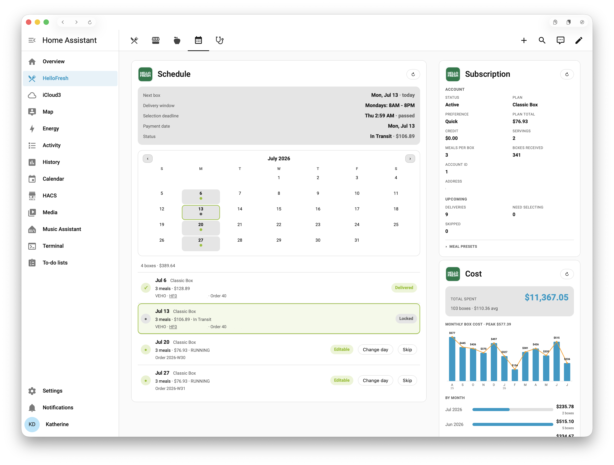

# Dashboard & card reference

The integration packages seven Lovelace cards. They are **registered automatically** — no manual
resource entry, no HACS frontend add-on — and each reads its data on demand from the integration's
services rather than from entity attributes, so they show detail (full menus, images, per-item
prices) that would never fit in a sensor.

For the ready-made dashboard that assembles these into views, see
[`dashboard/hellofresh.yaml`](../dashboard/hellofresh.yaml) and the
[HelloFresh Dashboard](../README.md#hellofresh-dashboard) section of the README. This page covers
each packaged card, plus the one dashboard view built without one
(the [Missing Ingredients view](#missing-ingredients-view), which uses Home Assistant's built-in
to-do card).

| Card | Type | What it is for |
|---|---|---|
| [Meal planner](#meal-planner-card) | `custom:hellofresh-meal-planner-card` | Browse each week's menu, change your meal selection, skip/unskip |
| [Market](#market-card) | `custom:hellofresh-market-card` | Browse and order Market add-ons per week |
| [Recipes](#recipes-card) | `custom:hellofresh-recipes-card` | Browse the public ~10,000-recipe catalog and manage favorites |
| [Food Profile](#food-profile-card) | `custom:hellofresh-food-profile-card` | View and edit the preferences behind auto-preselection |
| [Schedule](#schedule-card) | `custom:hellofresh-schedule-card` | Next-box summary, delivery calendar, per-week timeline |
| [Subscription](#subscription-card) | `custom:hellofresh-subscription-card` | Condensed account overview |
| [Cost](#cost-card) | `custom:hellofresh-cost-card` | Spending total with a monthly chart |

## Common options

Every card accepts these, so they are omitted from the per-card examples below:

| Option | Applies to | Description |
|---|---|---|
| `title` | all | Replaces the card's default header text. |
| `config_entry_id` | all | **Only needed with more than one HelloFresh account** — picks which one the card reads. With a single account, omit it. |
| `logo` | all | Set `true` to show the bundled HelloFresh logo in the header (or a URL for a custom image). |
| `image_width` | cards showing food images | Width in pixels for recipe/item images (default 400). Larger looks sharper on wide screens at the cost of more data. |

A minimal card is just its type:

```yaml
type: custom:hellofresh-market-card
```

## Meal planner card


The integration ships a custom Lovelace card, **`custom:hellofresh-meal-planner-card`**, for browsing your delivery weeks recipe-by-recipe and changing the selection on weeks that are still editable. It reads full per-week recipe detail on demand via `hellofresh.get_weeks`, so it shows the complete menu with images, your current picks highlighted, calories, and per-protein tags — none of which fit in a sensor attribute.

The card is served and registered automatically when the integration loads (no manual resource step in storage-mode dashboards). Add it to any dashboard:

```yaml
type: custom:hellofresh-meal-planner-card
```

What it does:

- **Week cursor** (‹ ›) across past, current, and upcoming weeks, **opening on the current week** by date. A **Current Week** button jumps back to it, and the header shows the delivery date plus how far off it is (e.g. `Mon, Jul 6 · in 3 days`).
- **Recipe grid** with lazy-loaded images (resized via HelloFresh's Cloudinary transform), a protein-color dot, description, calories, and the total cooking time (the same headline number the HelloFresh site shows on its tiles). Your chosen meals are highlighted with a ✓, and the per-week **meal count** appears alongside your plan's count (e.g. `2 meals (plan: 3)` on a resized week). The grid is **sorted** so selected meals lead, with the rest grouped by dish so a meal's variants sit together.
- **Past weeks** show what actually shipped, not the planning menu:
  - Within the [**Full menu history** window](../README.md#options) (2 weeks by default) a delivered week keeps its **full browsable menu** — the one HelloFresh really published — with delivered meals marked ✓, so the current week doesn't collapse the day after the box arrives.
  - **Older** weeks show **only the delivered meals**, sourced from delivery history — never the browsable catalog or its auto-fill.
  - **Paused/skipped** weeks correctly show no meals, since nothing shipped.
  - How far back you can browse is the [**Past delivery history** option](../README.md#options) — **26 weeks** by default, raisable to 104.
- **Recipe videos** — a handful of meals each week ship with a short promo clip; those tiles get a ▶ button that opens the video in a lightbox over the card (Escape or a backdrop tap closes it). Coverage is sparse by HelloFresh's own doing — typically a few meals out of several hundred — but delivered meals on **past** weeks keep their clips too. HelloFresh serves a mix of `.mp4` and `.mov`, but both are delivered as `video/mp4` and play everywhere once the player declares that type rather than letting the browser guess from the file suffix. A clip that genuinely fails to load says so instead of showing a black box, the player offers an "open it directly" link, and the still image always remains the tile's base layer.
- **Favorite hearts** — meals in your cookbook show a ♥. Read-only here, matching HelloFresh's own site; add and remove favorites from the [Recipes card](#recipes-card). Turn the hearts off with the [**Show favorite hearts** option](../README.md#options).
- **Per-serving price** — each tile shows what the meal actually costs per serving (from HelloFresh's own `itemPrice`), separate from the premium surcharge badge, which shows only the uplift over a classic meal.
- **Menu badges & dietary chips** — a meal's HelloFresh badge (BESTSELLER, NEW, 20 Min or Less, Premium Picks, …) renders in HelloFresh's own colors for that badge, and dietary chips (GLP-1 Support, Carb Conscious, …) appear on tiles as quiet outlined pills — a deliberate second tier, so solid color always means HelloFresh's own badge — under their current names via the same spelling-proof matching the filter bar uses — a HelloFresh tag renaming can't silently drop a chip the filter still matches.
- **"You've had this before"** — meals HelloFresh has previously delivered to you show an ordered-count and the week of the last one; meals you have rated show your star rating. Both come from HelloFresh's own records and appear only on the minority of meals that have them.
- **Full recipe view** — tap any meal on **any week** to open the complete recipe: ingredients with amounts, a servings switcher, step-by-step instructions, utensils, allergens, nutrition, and the printable recipe-card PDF. Selection never competes with the tap: on editable weeks meals are chosen with the **+ Add** pill and the **− N +** stepper instead (the same model as the [Market card](#market-card)) — and the sheet itself carries a pinned footer with the same **+ Add** / servings controls, so you can read a recipe and add it without leaving the sheet ("Not in this week's box" / "In this week's box"). On weeks you can't edit, the footer simply isn't there. Same sheet the [Recipes card](#recipes-card) uses. Tiles are keyboard-accessible: Tab to one and press Enter or Space to open the recipe (here, in the Market card, and in the Recipes card alike).

  
- **Sold-out meals** — a meal HelloFresh has marked sold out is greyed out with a **Sold out** ribbon. This is **advisory, not enforced**: the **+ Add** pill stays tappable and `select_meals` still submits, logging a warning. See the note below for why.
- **Variant differentiation** — when HelloFresh lists the same dish in several forms, the tile calls out exactly what differs: the modifier (e.g. "2x Bacon", "Gluten-Free Linguine"), any per-serving surcharge, and protein/calorie deltas. The plain, unmodified base option in such a set carries no modifier label. Genuinely identical duplicate listings are collapsed into a single tile.
- **Edit, quantity & save** on editable weeks (when `allowed_actions.mealSwap` is true and the selection deadline hasn't passed): build a pending selection with each meal's **+ Add** pill, use the **− N +** stepper to set per-meal servings (a doubled portion fills two box slots; **−** at one serving removes the meal), then **Save selection** submits it via `hellofresh.select_meals` and re-reads to confirm (**Cancel** discards the edit). You can choose **more or fewer** distinct meals than your plan — the box **resizes** for that week (and HelloFresh reprices it accordingly), down to a minimum of **2 meals**. While the selection saves, a "Please wait while saving selections…" banner is shown, and afterward the card stays on the week you edited. If HelloFresh **downsizes the box** to fit your save (a seamless downgrade), a dismissable amber warning appears on that week. Locked/past weeks render read-only.
- **Order strip** at the top of each week showing that week's order detail (status, carrier, tracking number/link, the **delivered date** on boxes that have arrived — the actual carrier delivery timestamp from HelloFresh's tracking feed, shown in your local timezone — billed total, order ID), falling back to the standing plan price for weeks not yet billed.
- **Meal filters** (current & upcoming weeks) — a **collapsible filter panel** whose groups match the HelloFresh website's own filter panel, name for name. Collapsed (the default) it is a single **Filters · N active** row, with each active selection shown as a chip you can remove with its ✕ right there; tap the row to expand it into one aligned line per group (the expand/collapse state is remembered). The groups: **Categories** (the website's menu sections — This Week's Menu, Health Conscious Menu, Family Menu, Bestsellers, Your Top Recipes, Order It Again, … — single-select, drawn from each week's menu payload so they track whatever HelloFresh publishes), **Main Protein** (Beef, Poultry, Pork, Seafood, Lamb, Veggie — tap any combination, or **All** to clear), **Dietary Preference** (the site's exact list: Vegetarian, Under 650 Calories, High Protein, Carb Conscious, Fiber Powered, Gluten-Free Friendly, Sodium Smart, Low Added Sugar, Organic Protein, GLP-1 Support), **Total Cooking Time** (Under 15 / 20 / 30 Minutes — single-select, as on the site), **Cuisine Type** (Classic American, Italian, Mediterranean, East Asian, South & Southeast Asian, Latin American, Global), **Dish Type** (Bowls, Handhelds, Pasta & Noodles, Classic Plates, Soups & Salads, Family Style), **Ingredients to Avoid** (Milk, Wheat, Nuts, Spicy, Pork — all three multi-select; see below for how they differ), **Highlights** (New, Bestsellers, Cooked Before — read from HelloFresh's own badges, tags and delivered-count; single-select, since these are mutually exclusive views of the menu), and a **hide variants** toggle so only the base meal of each dish shows (the 2× protein, protein-swap and veggie-swap versions are collapsed away). Protein chips widen the selection (a meal has one protein), while each dietary chip adds a constraint — pick High Protein *and* Sodium Smart to see meals that are both, matching the site's own MULTI-AND declaration. Dietary categories match the tags HelloFresh puts on each recipe (under every spelling it has used — e.g. GLP-1 meals are tagged "GLP-1 Support", "GLP-1 Friendly" or "GLP-1 Balance" depending on the season), and the calorie/time categories also accept an untagged meal whose own numbers qualify. Your currently selected meals always stay visible regardless of the filter. **Cuisine Type, Dish Type and Ingredients to Avoid work differently:** menu recipes carry no allergen data and their tags don't use the site's cuisine/dish-type slugs, so instead of matching tags the card hands the active selections in those three groups to HelloFresh's own filter service — one `hellofresh.get_menu_courses` call per selection change, covering all three groups at once — and narrows the grid to the meals it returns, intersected with whatever the tag-matched groups already allow. Results therefore match the website exactly, allergen exclusions included. These three groups appear only on weeks whose menu carries the filter definitions (`menu_filters` in `get_weeks`, i.e. current and upcoming weeks); their chip names and order come straight from that payload, and a remembered choice that the displayed week doesn't offer is simply ignored there. Answers are cached per week and selection, so re-rendering never re-asks; while a lookup runs the grid stays as it is with a small "Filtering…" note in the filter row, and if the lookup fails the card logs a warning and shows the tag-matched result alone rather than a blank week. The bar is hidden on weeks past the [**Full menu history** window](../README.md#options) (which just show what was delivered); a just-delivered week still has its full menu, so it keeps the filters.
- **Week actions** — a **Show selected only** toggle (hide everything but your picks), **Skip / Unskip** the displayed week (shown only where the action can still change something — editable weeks, or skipped weeks whose deadline hasn't passed — matching the [Schedule card](#schedule-card)'s pill; locked, delivered, and past weeks get no dead button), a **refresh** button, and a banner summarizing any weeks that still need a selection (tap it to jump to the first one). Filter and view choices are remembered across weeks and reloads.
- **Week stays in sync with the Market card** — navigating to a week here moves the [Market card](#market-card) to the same week (and vice versa), even when the two cards are on different dashboard views. The selected week is remembered across reloads and tab switches.

> **Where the sold-out flag comes from, and why it is advisory.** HelloFresh reports `isSoldOut` only in its `menus-service` catalog, while the primary per-week menu endpoint carries the pricing and delivery-history fields but no availability flags — the two are disjoint. To get both, the integration fetches the catalog once per refresh for the weeks you can still change and overlays *only* the availability flags onto the existing recipes, leaving every other field alone. Weeks that are already delivered or past their cutoff are skipped, since the flag cannot change an outcome there.
>
> That catalog is HelloFresh's **anonymous regional menu**, and it has not been confirmed to track per-customer availability — a meal could read as sold out regionally while HelloFresh would still accept it for your subscription. So the flag is surfaced as advice and never used to block: greying out a meal you could actually pick, with no way to override, would be worse than the server-side rejection it avoids. HelloFresh remains the authority on its own inventory.

> Meal-selection writes are confirmed on the US and UK sites; other regions fall back to best-effort guesses (see [Current Scope](../README.md#current-scope)). Browsing works everywhere the menu loads.

> **YAML-mode dashboards only.** Storage-mode dashboards register every card automatically — nothing to do. In **YAML mode**, add each card once under **Settings → Dashboards → Resources** as a *JavaScript module*: `/hellofresh/hellofresh-<name>-card.js?v=<integration version>` (e.g. `?v=2.68`). The `?v=` must match your installed version, and you must update it after each upgrade or browsers keep serving the cached card. The startup log prints the exact URLs. (`hellofresh-recipe-detail.js` and `hellofresh-shared.js` are shared modules the cards import themselves — not resources you register.)

## Market card


The integration also ships **`custom:hellofresh-market-card`**, for browsing and ordering HelloFresh Market add-ons (the extras you can add to a box: appetizers, breakfast, desserts, proteins, sides, and more) week by week. Like the meal-planner card it reads on demand from `hellofresh.get_weeks` and writes via `hellofresh.select_market_items`.

```yaml
type: custom:hellofresh-market-card
```

What it does:

- **Week cursor** (‹ ›) across past, current and upcoming weeks, **opening on the current week** by date, with a **Current Week** button and the same header as the meal-planner card (delivery date plus how far off it is, e.g. `Mon, Jul 6 · in 3 days`). How far back you can browse is the [**Past delivery history** option](../README.md#options) — the same setting the [meal-planner card](#meal-planner-card) uses, so both cards show the same weeks.
- **Items grouped by category** (Appetizers, Proteins, Desserts, …), each tile showing the image, name, price, and calories. Sold-out items are dimmed and badged. Font sizes and header match the meal-planner card.
- **Category filter bar** (labeled **Categories**) — chips for the week's Market categories (All / Appetizers / Breakfast / Desserts / Lunch / …), same look and behavior as the [meal-planner card](#meal-planner-card)'s protein filter: pick one or several to narrow the catalog, **All** clears, and the choice is remembered across weeks and reloads. Items already in your cart always stay visible regardless of the filter. The chips come from whatever sections the viewed week's catalog actually carries, so new HelloFresh shelves appear on their own; the bar hides on past weeks, while "show selected only" is on, and on history-sourced weeks (which don't record sections).
- **Quantity steppers** — set how many of each item to order with a **− N +** control (clamped to the item's max), with a live **Market total** of the selection. **Save selection** writes it via `hellofresh.select_market_items` (which preserves your meal selection, including a week you've resized to fewer/more meals); a "Please wait while saving selections…" banner shows during the write and the card stays on the week you edited. If HelloFresh downsizes the box to fit, a dismissable amber warning appears on that week. **Cancel** discards the edit. A **show selected only** filter (remembered across weeks and reloads) hides the rest.
- **Full recipe view** — tap any item for its complete recipe: ingredients with amounts, a servings switcher, step-by-step instructions, utensils, allergens, nutrition, and the printable recipe-card PDF. Add-ons carry a normal HelloFresh recipe id, so this is the same sheet the [Meal planner](#meal-planner-card) and [Recipes](#recipes-card) cards use. Quantities are changed with the ± steppers, so the tile itself is free for this on every week.
- **Past weeks show only what was ordered** — a past week displays just the market items that were actually selected/ordered (never the full browsable catalog), and the show-all/selected toggle is hidden since it no longer applies. A week where you ordered no add-ons is still listed, showing *No market items selected*, so the week strip matches the meal-planner card rather than skipping weeks.
- **Where past-week data comes from** — HelloFresh only publishes a week's browsable Market catalog for about the [**Full menu history** window](../README.md#options), so beyond it the card falls back to your **delivery history**, which records what each shipped box actually contained. Items keep their category headings (Appetizers, Proteins, …) while the catalog is still available; for older weeks, history records *what* you bought but not which Market category it came from, so those weeks list the items in order without category headings. Prices and quantity steppers are also absent on those weeks — delivery history does not report them, and a shipped week cannot be edited anyway.
- **Week stays in sync with the meal-planner card** — navigating here moves the [meal-planner card](#meal-planner-card) to the same week and vice versa, across dashboard views, remembered across reloads and tab switches.

## Recipes card


The integration also ships **`custom:hellofresh-recipes-card`**, a browser for HelloFresh's **public recipe catalog** (~10,000 recipes) with cookbook favoriting built in. Unlike every other card here, this one shows content that is **not tied to your subscription**: the catalog is the same for all customers and is unrelated to your delivery weeks. It reads `hellofresh.get_recipe_collections`, `hellofresh.get_catalog_recipes` and (for the Cookbook chip) `hellofresh.get_favorites` on demand — none of this is part of the sensor poll, since 10,000 recipes have no business in entity state.

```yaml
type: custom:hellofresh-recipes-card
# collection: chicken-recipes # optional starting category slug
# limit: 50                   # recipes loaded per category (1–200, default 50)
```

What it does:

- **Category chips** — every category HelloFresh publishes, fetched from the site itself and switched without a page reload. This is not a curated subset: the US catalog currently returns **~60** of them, spanning cuisines (Indian, Korean, Thai, Cuban, Vietnamese, …), dish types (Pasta, Burger, Risotto, Soup, …), and dietary lines (Carb Smart, Calorie Smart, Plant-Based, Pescatarian, …). The list is whatever HelloFresh serves on the day, so new categories appear on their own with no integration update.
- **♥ Cookbook** — a chip alongside the categories that lists **your** saved recipes instead of catalog browse content. This shows every bookmark, including the ones HelloFresh's own website hides: its cookbook page only ever renders a 3-item preview, while the underlying endpoint reports the true total and pages the rest. Un-favoriting a recipe here removes it from the list rather than leaving a hollow heart on something you no longer have saved.
- **Refine row** — categories that have sub-categories (Noodle → Ramen / Udon / Rice / Soba / Yakisoba; Chicken → Breast / Thighs / Cutlets / …) show a second chip row when selected. These children are absent from HelloFresh's top-level category list, so this is the only route to them.
- **Search field** — a text box under the header that searches the **whole ~10,000-recipe catalog** as you type (debounced), across every category at once, using HelloFresh's own recipes-service search API — the same search the website's recipe pages use, and served by a plain `/gw` API, so it is immune to the build-id caveat below. Results show up to `limit` recipes with the usual tiles, hearts, and full recipe view; tapping a category chip clears the search and returns to browsing. On the **Cookbook** view the same box instead filters your saved list locally — those are your bookmarks, which the catalog-wide search doesn't know about.
- **Recipe grid** — thumbnail, name (linking to the recipe on hellofresh.com), headline, star rating with its ratings count, and prep time.
- **Favorite hearts** — tap to add or remove a recipe from your cookbook. A rejected write surfaces as an error rather than a heart that silently springs back.
- **Full recipe view** — tap any tile for the complete recipe in an overlay: ingredients with amounts, a **servings switcher** (2 / 4 / …) that rescales those amounts, step-by-step instructions, utensils, allergens, nutrition, and a link to the printable recipe-card PDF. Fetched on demand, one request per recipe. This part reads a plain HelloFresh API rather than the website, so it is **not** affected by the build-id caveat below.
- **Cross-card sync** — favoriting broadcasts the same `hellofresh-data-changed` event the other cards use, so the [Meal planner](#meal-planner-card)'s hearts pick up the change on its next refresh.

> **Note:** the recipe listing and categories come from HelloFresh's website rather than a stable API, so this card is inherently less reliable than the others. It self-heals automatically when HelloFresh deploys. Recipe *detail* is unaffected.

## Food Profile card


The integration also ships **`custom:hellofresh-food-profile-card`**, for viewing and editing your **food profile** — the preferences HelloFresh uses to automatically pre-select meals for upcoming weeks. It reads the profile and the full catalog of options live from `hellofresh.get_food_profile` (the profile isn't part of the regular sensor poll) and saves via `hellofresh.set_food_profile`.

```yaml
type: custom:hellofresh-food-profile-card
```

What it does, driven entirely by the options catalog so new HelloFresh options appear automatically:

- **Dietary preference** — single-select (flexitarian, mostly-meat, vegetarian, pescatarian).
- **Multi-select chips** — taste exclusions (with a "None" choice where HelloFresh allows it), nutrition goals, meal types, and goals.
- **Like / Dislike** — a tri-state 👍/👎 toggle per item for cuisines, flavors, dish types, and proteins (👍 = +100, 👎 = −100, neither = neutral), exactly matching how HelloFresh weights them.
- **Household** — adults / children selectors.
- **Completion progress** — a slim bar showing how many profile fields HelloFresh considers answered (its own reckoning, not a guess), so it's obvious when something is still worth filling in. It disappears once the profile is complete, and is simply omitted if HelloFresh doesn't report it.
- **Save / Reset** — Save writes only the changed sections via `hellofresh.set_food_profile`; Reset reverts the draft to the server's current profile. The Save button is enabled only when there are unsaved changes.

## Missing Ingredients view


The one dashboard view built **without** a packaged card: two of Home Assistant's built-in
**to-do list** cards side by side, one per delivery week, over `todo.prep_list` and
`todo.prep_list_week_2`. They list the pantry staples HelloFresh does **not** ship — salt, oil,
butter, eggs — for the meals selected on your next two boxes, with quantities summed per week and
each item due-dated to its week's delivery, so you can check things off as you shop.

```yaml
- type: heading
  heading: Ingredients needed for this week
- type: todo-list
  entity: todo.hellofresh_us_prep_list
```

(Substitute your own entity prefix, and repeat with `todo.hellofresh_us_prep_list_week_2` for the
second week — the [example dashboard](../dashboard/hellofresh.yaml) lays both out in a `sections`
grid.) The lists themselves are ordinary to-do entities, so they also work from the companion app
or a voice assistant. How they are built — the two-entity design, what qualifies as "not
shipped", and the exact-conversion rules for summed quantities — is documented under
[Prep lists](entities.md#prep-lists).

## Schedule card



The integration also ships **`custom:hellofresh-schedule-card`**, a clean overview of your delivery schedule. Like the other cards it reads per-week data on demand from `hellofresh.get_weeks` (one call builds the whole view).

```yaml
type: custom:hellofresh-schedule-card
# calendar: true            # optional month calendar of delivery days (default true);
#                           # the timeline below follows the displayed month
# max_weeks: 8              # timeline cap on upcoming rows (default 8; applies with calendar: false)
# past_weeks: 4             # recent past deliveries in the timeline (default 4; 0 hides;
#                           # applies with calendar: false)
```

What it does:

- **Next-box summary** — the nearest upcoming delivery's date (with a relative "in 3 days"), the courier **delivery window**, the selection-deadline countdown (highlighted red when under 24h), the next payment date, the active coupon, and the order status with the box total. When nothing is upcoming (paused subscription, end of data) it shows the most recent box, labelled **Last box**. A **Discount** row appears when a discount is applied to that box (from HelloFresh's own price calculation), so a coupon or credit promise is visible where the box is.
- **Delivery calendar** — a built-in month grid with every delivery day marked in its week's state colour (green delivered/set, amber needs picking, struck-through for skipped), with ‹ › month navigation and a Today button. Navigation stops at the edges of the loaded data (the arrows disable) instead of paging into empty months. It covers the full loaded range (your configured past history through the scheduled weeks ahead), so a separate `calendar.delivery_schedule` dashboard widget is no longer needed. Clicking a marked day — or a timeline row — jumps the [Meal planner](#meal-planner-card) and [Market](#market-card) cards to that week, even across dashboard views, and the week those cards are currently showing gets a green ring on the calendar. Timeline rows are keyboard-accessible (Tab to a row, Enter/Space selects the week).
- **Timeline** — a chronological row per week, **following the calendar's displayed month**, so navigating months swaps the list to that month's delivery weeks and the two always agree. (With `calendar: false` it instead shows the last `past_weeks` deliveries plus up to `max_weeks` upcoming.)
  - A month with more than one week opens with a **roll-up line**: boxes, skipped weeks, and the summed billed cost.
  - Past deliveries are dated by when the box **actually arrived**. Future weeks beyond HelloFresh's published menus (empty scheduling shells with no meal data) are hidden, but skipped weeks always appear so the gap stays visible.
  - Each row shows a **status dot, date, and week label**, plus:
    - a **detail line** — meals selected (with the plan count as context on a resized week), the market add-on count, the week's billed box total, and box/tracking status when it adds information (or "Pick N meals" / "Review meals" with time left, or "No box this week");
    - a **meta line** with the week's **order ID** and, on shipped and delivered boxes, the **carrier and tracking number** (linked), and a state badge. The current box is highlighted; **Editable** / **Needs picking** / **Skipped** / **Delivered** / **Locked** states are colour-coded. A week whose meals HelloFresh auto-picked shows a single amber **Preselected** badge in place of "Needs picking" (same signal as the meal-planner card, without the redundant double chip).
- **Stays current on its own** — the card re-fetches on the integration's configured **Refresh interval** (read from the `get_weeks` account payload, so the two always agree), when the browser tab becomes visible again after the data has aged past that interval, and immediately after you save a selection or skip a week in the meal-planner/market cards. Deadline countdowns and relative dates tick along once a minute in between. A refresh never blanks the card: the last good view stays on screen (dimmed while reloading), and a failed refresh shows an inline notice with a Retry button on top of it. While a box is due or on the road (the integration's delivery-day watch is active) the card drops to the **Delivery-day watch interval** instead, so a dashboard open on delivery day sees the box land within minutes.
- **Skip/Unskip per week** — a Skip pill appears on **editable** timeline rows only (and Unskip on skipped weeks whose deadline hasn't passed) — never on locked, delivered, or past weeks, where the action couldn't change anything. It calls the same `skip_week`/`unskip_week` services as the meal-planner card; the card refetches afterward and a failure shows as an inline notice. Meal selection editing stays in the [Meal planner card](#meal-planner-card).
- **Change delivery day per week** — editable weeks that offer alternate delivery days get a **Change day** pill; it opens that week's available days (from HelloFresh's per-week one-off options, current day highlighted) and picking one calls `hellofresh.reschedule_week`. The first time you open the picker it fetches the plan's delivery-day catalog (`hellofresh.get_delivery_options`) to label each choice with its **weekday name** (and any surcharge) instead of just a date; if that lookup is unavailable it falls back to date labels. Failures surface in the same inline notice.
- **Holiday markers** — a week whose delivery HelloFresh has shifted for a holiday is marked 🎄 on its calendar day and timeline row, with the holiday message as the tooltip (the full notice text lives in the [Subscription card](#subscription-card) banner).

## Subscription card

The integration also ships **`custom:hellofresh-subscription-card`**, a condensed account overview that replaces the example dashboard's long "Subscription details" entities list. It reads everything in one call from `hellofresh.get_account_summary` — the same values the corresponding sensors report (the service and the sensors share one value dispatcher, so they can never disagree) —. Because it doesn't reference entities, it needs no entity-ID prefix fix-up.

```yaml
type: custom:hellofresh-subscription-card
```

What it does:

- **Condensed label-over-value grid** in two sections — **Account** (account ID, status, plan, meal **preference**, plan total, credit, servings, meals per box, boxes received, address) and **Upcoming** (delivery count, weeks needing selection, skipped count, next skipped week). Empty values drop their cell entirely, so the card only spends space on what exists — and it deliberately shows nothing the [Schedule card](#schedule-card) already covers (payment date, coupon, preselected flag, per-box detail). The meal preference shows its full preset name ("Quick & Easy") once the preset catalog has loaded, or the plain slug ("Quick") until then. The Account section also shows the plan total's **Shipping** and (when one applies) **Discount** split, and the **Card on file** ("Visa ending in 4242 · exp. May 2029" — brand, last four digits and expiry month; the integration never stores the billing address).
- **Clickable counters** — "Need selecting" and "Next skipped" (when a week is behind them) jump the [Schedule card](#schedule-card) and [Meal planner](#meal-planner-card) to that week over the same cross-card week-sync channel the other cards use.
- **Meal presets reference** — a collapsible "Meal presets" section (fetched lazily from `hellofresh.get_presets` on first expand) lists the region's presets with their descriptions — the human-readable names behind the plan preference — and highlights the one that's yours. Read-only: HelloFresh exposes no API to change a plan's preset, so this is a "what do these mean / which is mine" reference.
- **Holiday-delivery notice built in** — when HelloFresh announces a holiday schedule change, an amber banner shows the message and the shifted delivery date at the top of the card (replacing the separate conditional markdown card the dashboard used to need), and disappears once the notice clears.
- **Payment-method warning built in** — when HelloFresh's own check flags the card on file as expiring (amber) or expired (red), a banner says so at the top of the card, naming the card ("Your Visa ending in 4242 on file expires soon (May 2029)"), so a box does not silently fail to ship. Backed by `binary_sensor.payment_method_expiring`.
- **Stays current on its own** — same contract as the schedule card: re-fetches on the integration's configured refresh interval, when the tab becomes visible again after the data has aged, and immediately after a sibling card saves a change; a failed refresh shows an inline notice over the last good view instead of blanking it. Follows the delivery-day watch cadence while a box is in progress, like the schedule card.
- It's read-only.

## Cost card

The integration also ships **`custom:hellofresh-cost-card`**, a running-cost view of what HelloFresh actually costs you over time. It reads one call from `hellofresh.get_spending`, which aggregates the **full billing history** (up to ~200 past + upcoming charges) — so the running total is your **lifetime** spend, not just the handful of weeks the schedule card shows. The same billing totals back the payment sensors, so the figures agree with them.

```yaml
type: custom:hellofresh-cost-card
# chart: true               # monthly-cost bar chart (default true; set false to hide)
# chart_months: 12          # months spanned by the chart (default 12 — the last year; 1–24)
# months: 6                 # months in the roll-up list (default 6, 0 hides the section)
# weeks: 6                  # recent boxes to list (default 6, 0 hides the section)
```

What it does:

- **Running total headline** — the lifetime amount spent across all delivered boxes, its box count, and a derived per-box average.
- **Monthly cost chart** — a self-contained SVG histogram of the last year's monthly box cost (`chart_months` slots), with the dollar amount printed above each bar and a trend line connecting the bar tops. Months with no delivery (paused/skipped) render as empty slots so the timeline stays unbroken, and the trend line bridges them rather than dipping to zero. No external chart library — it draws inside the card's sandbox and scales to the card width.
- **By-month roll-up** — below the chart, a list giving each month's exact total and box count with a bar scaled to the largest month in view (newest first, capped by `months`).
- **Recent boxes** — a per-box list of delivery date + amount (newest first, capped by `weeks`).
- **Upcoming boxes** — a box that's been scheduled/charged but not yet delivered is shown with an "upcoming" tag and **excluded from the running total** (a running cost is money already spent).
- **Stays current on its own** — re-fetches on a periodic interval, when the tab becomes visible again after the data has aged, and immediately after a sibling card saves a change; a failed refresh shows an inline notice over the last good view. Read-only.

Place it on the Schedule tab alongside the subscription card (the example dashboard does this).
