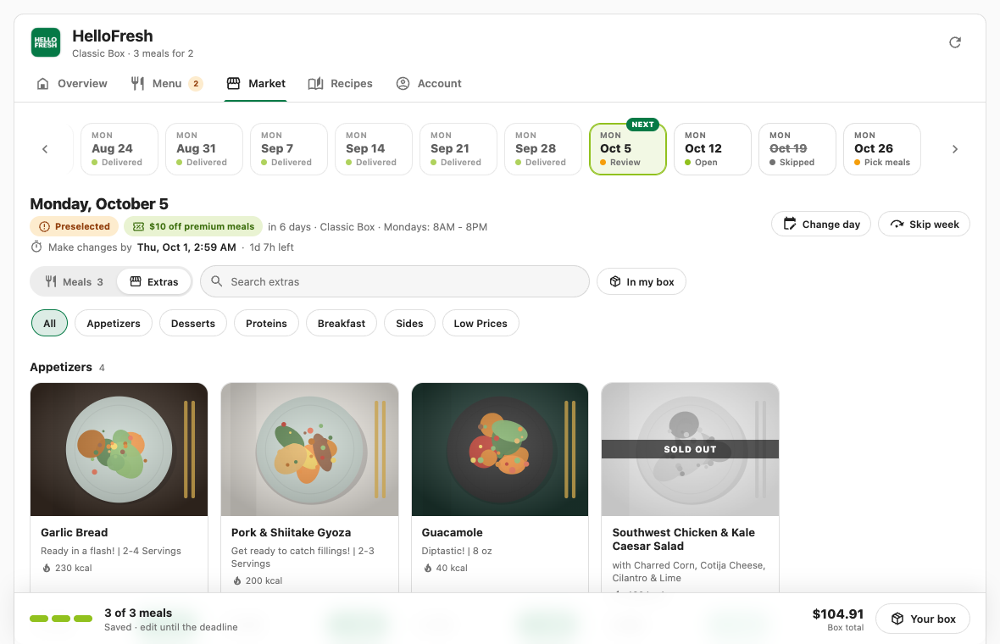
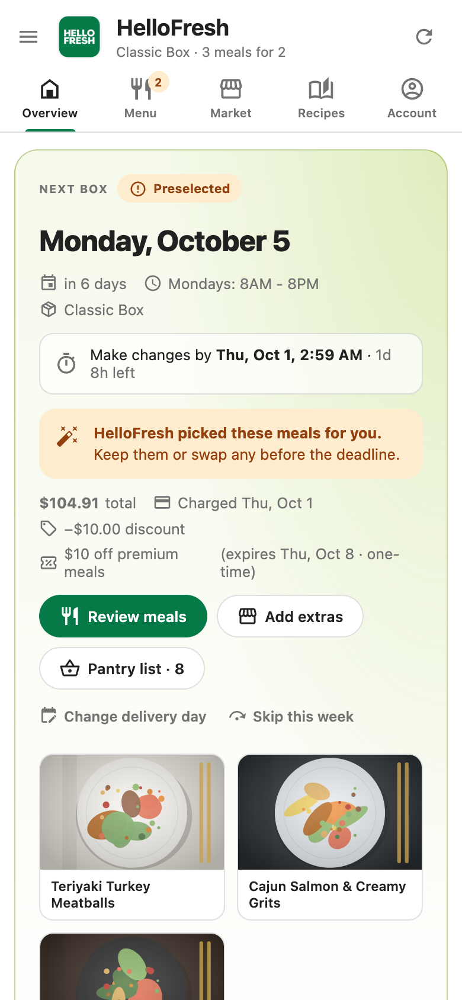

# HelloFresh card


**`custom:hellofresh-card`** is the whole HelloFresh experience in one card, organised the way
hellofresh.com is: **Overview**, **Menu**, **Market**, **Recipes** and **Account** tabs over one
shared set of data. The pieces work together — a week you open from the Overview is the week Menu and
Market show, meals and add-ons for that week are one box with one Save, and the pantry list sits
with the box it belongs to.

You don't have to build anything to use it: the integration puts it in Home Assistant's
[sidebar](#in-the-sidebar). It is also an ordinary Lovelace card for
[any dashboard](#adding-the-card-to-a-dashboard). Everything it shows is read on demand from the
integration's services, not from entity attributes, so it can show what would never fit in a
sensor: whole menus with photos, per-item prices, recipes, tracking scans.

*Every account detail in the screenshots on this page is made up.*

- [In the sidebar](#in-the-sidebar)
- [Adding the card to a dashboard](#adding-the-card-to-a-dashboard)
- [Overview](#overview) · [Menu](#menu) · [Market](#market) ·
  [Your box](#your-box-the-box-bar-and-saving) · [Recipes](#recipes) · [Account](#account)
- [Phones, tablets and themes](#phones-tablets-and-themes) · [Stays current](#stays-current)
- [Moving from the classic cards](#moving-from-the-classic-cards)
- [Classic cards reference (deprecated)](#classic-cards-reference-deprecated)

## In the sidebar

Once the integration is set up, **HelloFresh** appears in Home Assistant's sidebar
(<code>/hellofresh-app</code>) and opens the card full screen — no dashboard, no YAML. On a phone
it runs edge to edge, and its header carries the usual button for opening the sidebar. It is there
for every user of your Home Assistant, like any dashboard.

- **More than one HelloFresh account?** Each gets its own sidebar entry, named after its
  integration entry (rename the entry to rename it) and pinned to that account.
- **Don't want it?** Turn off **Show HelloFresh in the sidebar** in the integration's
  [options](../README.md#options); the entry disappears straight away. You can still put the card
  on any dashboard.
- It is the same card and the same code as on a dashboard, and it shares its remembered tab, week
  and filters with a HelloFresh card on a dashboard (with one account).

## Adding the card to a dashboard

The card is registered with Home Assistant automatically (no resource to add, no HACS frontend
add-on), so on any dashboard it is one line — or pick **HelloFresh** in the card picker:

```yaml
type: custom:hellofresh-card
```

It works in a narrow column or a phone but shines full width. The ready-made
[`dashboard/hellofresh.yaml`](../dashboard/hellofresh.yaml) is a single panel view with just this
card, if you want a dashboard of your own rather than the sidebar entry.

| Option | Default | Description |
|---|---|---|
| `views` | all five | The sections to show, in order: `overview`, `menu`, `market`, `recipes`, `account`. One section gives a focused card with no tab bar. |
| `default_view` | the last one used | The section the card opens on. |
| `accent` | `brand` | `brand` is HelloFresh green; `theme` uses your Home Assistant theme's primary colour. |
| `title` | `HelloFresh` | Header title; `""` hides it. |
| `logo` | `true` | `false` hides the bundled HelloFresh logo, or give a URL for your own image. |
| `image_width` | `400` | Width in pixels recipe images are resized to. Larger looks sharper on big screens and costs more data. |
| `recipes_limit` | `50` | Recipes loaded per category in Recipes (1–200). |
| `recipes_collection` | Top rated | The category slug Recipes opens on, e.g. `chicken-recipes`. |
| `spending_months` | `12` | Months in the spending chart (1–24). |
| `config_entry_id` | — | **Only with more than one HelloFresh account**: which one the card shows. |

Every option is also in the card's visual editor.

**Focused ("breakout") cards.** With a single entry in `views` the tab bar disappears and the card
is just that section — a recipe browser on a kitchen tablet, say:

```yaml
type: custom:hellofresh-card
views: [recipes]
title: Recipes
```

> **YAML-mode dashboards only.** Storage-mode dashboards (the default) get the card registered
> automatically. In **YAML mode**, add it once under **Settings → Dashboards → Resources** as a
> *JavaScript module*: `/hellofresh/hellofresh-card.js?v=<integration version>` (for example
> `?v=3.08`). The `?v=` must match your installed version, and must be updated after each upgrade
> or browsers keep serving the cached card; the startup log prints the exact URL. The card's own
> `hellofresh-card-*.js` modules, `hellofresh-shared.js` and `hellofresh-recipe-detail.js` are
> imported by the card itself — they are not resources to register. The sidebar entry needs none
> of this.

## Overview


- **Next box** — the nearest box that ships (or, with everything skipped, the next skipped week;
  with nothing upcoming, the last box). Its date, how far off it is, the delivery window, the box
  name and any holiday change; a **Make changes by** line with a live countdown (red under 24
  hours); the price, charge date, discount, coupon and voucher; and up to five of the chosen meals
  as photos, with the option you picked (tap one for its recipe). **Review meals** / **Edit
  meals** / **Choose meals** and **Add extras** go straight to that week in Menu and Market;
  **Change delivery day** and **Skip this week** sit underneath. When HelloFresh picked the meals,
  it says so; when you have unsaved changes to this box, it offers to finish them.
- **Delivery tracking** — once a box has a carrier, a four-step tracker (Preparing → Shipped → Out
  for delivery → Delivered) with the carrier's latest step, its estimate, the linked tracking
  number, a **History (N)** list of every scan, and the delivery photo and signer when the carrier
  provides them.
- **Needs your picks** — every other editable week still waiting on you, each a tap away, with its
  own countdown.
- **Before it arrives** — the pantry staples the next box doesn't include (the integration's
  [prep list](entities.md#prep-lists)), as a checklist you can tick right here, each amount right
  after its name in short form ("Black Pepper 3 tsp"). Ticks are the same to-do items the
  prep-list entities hold, so they sync with the companion app and voice.
- **Coming up** — the following weeks as cards (meal photos, state, price, deadline, and
  Edit / Change day / Skip or Unskip), or switch to **Calendar**.


- **Calendar** — a month of rounded day tiles under a weekday header, today circled, each delivery
  day filled in its state's colour with its icon and, where there's room, its state ("Delivered",
  "Open", "Pick meals", "Skipped"; a legend explains the icons on narrow screens). A month roll-up
  (boxes, skipped weeks, cost) and the month's weeks are listed beside it, and the calendar grows to
  the list's height rather than leaving a gap. Tapping a day opens that week in Menu, or a shipped
  or delivered box's delivery details. ‹ › stop at the edges of the loaded data.
- **Recent deliveries** — delivered boxes, newest first: when each actually arrived, what was in
  it, its bill and carrier (a camera marks a box with a delivery photo). **Show more** reaches back
  through the [Past delivery history](../README.md#options) window.


- **Delivery details** — tap a delivered or shipped box for the carrier's delivery photo and who
  signed (when the carrier provides them — Veho, HelloFresh's main US carrier, doesn't, and the
  details say so), the linked tracking number and every scan, newest first, the meals (tap for the
  recipe) and extras that were in it, and what it cost with any discount.

## Menu


- **Week strip** — every browsable week as a chip (day, date, and state: Open, Review, Pick meals,
  On its way, Delivered, Skipped, Locked). The next box is tagged **Next**, weeks with unsaved
  changes carry a dot, and ‹ › step through them. The card opens on the next box.
- **Week header** — the date, state, voucher and holiday badges, the deadline countdown, and the
  week's own actions: **Pantry**, **Change day**, **Skip week** / **Unskip week**. Notices explain
  a skipped, auto-picked, locked or downsized box; a settled box (locked, shipped, delivered) shows
  its order details or tracker.
- **One tile per dish** — HelloFresh's menu has a separate meal for each way to have a dish (2×
  protein, a protein or vegetable swap, "Added Bacon"), so a week of ~460 meals is really ~85
  dishes. Like the website, the card shows each dish once, as written, in the website's order with
  your box's meals first, and a filter can pick out one of its options (below).
- **+ Add** puts a meal in the box; its tile then becomes a **− N servings +** stepper (the bin at
  one serving removes it). Tapping a tile opens the full recipe, whose footer has the same Add /
  servings controls.


- **Customize** — a dish with options has a selector reading "Customize · 8 options" while it is
  as written, and the chosen option ("2x Chicken Cutlets") once it isn't. It opens a drawer of
  every option in the website's order — its ingredient photo, name and surcharge, the unchanged
  version first under the site's own label ("No Change", "No Protein", or the base protein).
  **Update box** switches a dish in your box to the chosen option, keeping its servings; **Add to
  box** adds a dish as chosen. The cart stores the option's own meal, exactly as the website does.
  If two versions of one dish are in the box, each gets its own tile. Sold-out options can't be
  picked.


- **Search** — narrows the week's menu by name, description, option or tag (every word must
  match).
- **Filters** — the website's filter panel, group for group: Categories (the site's menu sections,
  Double Protein among them), Main protein, Dietary preference (ANDed, as on the site), Cuisine
  type, Dish type, Ingredients to avoid, Total cooking time, and Highlights — New, Bestsellers,
  Cooked Before and **Favorites** (meals in your cookbook). Active filters show as removable chips
  when the panel is closed, and meals in your box always stay visible.
  - As on the website, a dish shows **its first option that fits** when the dish itself doesn't —
    the Salmon version of a chicken dish under Seafood, the 2× version under Double Protein.
  - Cuisine type, Dish type and Ingredients to avoid are answered by HelloFresh's own filter
    service (menu recipes carry no allergen data), and so is Main protein: the service places the
    few meals the menu leaves without a protein, such as a beef dish's "2x Tofu" swap under Veggie.
    Lamb, which the site doesn't offer, matches on the menu data alone. Answers are cached per week
    and filter; a "Filtering…" note shows while one is on its way, and if the service fails the
    card filters on the menu data rather than blanking the week.
- **In my box** — just what's in the box, still with its servings steppers.
- **Meal tiles** — photo, HelloFresh's own badge in its colours, favourite heart, promo-video play
  button, premium surcharge, protein dot, time / calories / protein, up to two dietary chips (the
  rest on hover), "Ordered 2× · last 2026-W34", your rating, and the per-serving price. Large menus
  show 60 dishes at a time with **Show more**. Past weeks outside the
  [Full menu history](../README.md#options) window show just what was delivered.

> **Sold-out meals are advisory.** A meal HelloFresh marks sold out is greyed with a ribbon but
> stays choosable. The flag comes from HelloFresh's anonymous regional catalog, which hasn't been
> shown to track what *your* subscription can order, so greying out a meal you could actually pick,
> with no way past it, would be worse than letting HelloFresh itself decide on save.

> Meal-selection writes are confirmed on the US and UK sites; other regions use the same endpoints
> and fall back to best-effort guesses (see [Current Scope](../README.md#current-scope)). Browsing
> works everywhere the menu loads.

## Market



The same week strip and header as Menu (a **Meals | Extras** switch moves between the two), then
the week's add-ons grouped by shelf with a shelf rail, search and **In my box**. **+ Add**, then a
**− N +** stepper per item (capped at the item's maximum; sold-out items can only be reduced). Tap
an item for its recipe; the recipe footer adds it too. Past weeks show only what was ordered.

## Your box: the box bar and saving

Menu and Market edit **one pending box per week**. A bar pinned to the bottom of the card shows it:
meal slots against your plan (amber when you've resized the box), meals, servings and extras, and
the price —

- unchanged: the box's bill (or your plan price, labelled as such);
- after changing meals: an **estimated total** from HelloFresh's own price calculation for exactly
  those meals (`hellofresh.preview_meal_price`, asked once you pause) plus your extras;
- after changing only extras: what the extras add.

**Save box** writes everything in one go: meals only through `hellofresh.select_meals`, extras only
through `hellofresh.select_market_items`, and both together through `select_meals` with
[`market_quantities`](services.md#hellofreshselect_meals) — one cart write, so a meal change can
never be undone by the Market write that follows it. **Review** opens the whole box: every meal and
extra with what's new, changed or removed, the price breakdown, and Save / Discard. Choosing more
or fewer meals than your plan resizes that week's box (minimum two), and the bar says so. If
HelloFresh downsizes the box on save, a notice stays on that week until you dismiss it.

Pending changes survive switching tabs and weeks, and the card's own background refreshes — they are
only dropped when saved, discarded, or no longer possible (the deadline passed).

## Recipes


HelloFresh's public catalog (~10,000 recipes) and your cookbook: **Top rated**, **Cookbook** (every
bookmark, including the ones HelloFresh's own cookbook page hides), every category HelloFresh
publishes in one scrollable rail (**All categories** expands it), a **Refine** row of
sub-categories (Noodle → Ramen / Udon / …), catalog-wide search (the cookbook filters locally),
favourite hearts, and the full recipe: ingredients with photos, amounts and allergens, a servings
switcher, step-by-step instructions with their photos and timers, utensils, nutrition and the
printable recipe card. Favouriting also refreshes the hearts on the Menu. None of this is tied to
your subscription.

> The recipe listing and categories come from HelloFresh's website rather than a stable API, so
> they are less robust than the rest of the card; they recover by themselves when HelloFresh
> deploys a new site build. Search and recipe detail use plain APIs and are unaffected.

## Account


- **Plan & billing** — your plan, meal preference (its full preset name), servings, meals per box,
  plan price with its shipping and discount split, credit, card on file (with its expiry state),
  boxes received, account ID and address; **Upcoming** counters, where "Need picks" and "Next
  skipped" open their week; **Plan settings** to change your **box size** and **delivery day**
  (this integration's [select entities](entities.md), behind a confirmation — they change every
  future box and the bill); the **Meal presets** reference; and **Integration status** (token
  health, write actions, payload checks, and a **Refresh from HelloFresh** button).
- **Food preferences** — the food profile HelloFresh uses to pick meals for you, with the site's
  own rules: proteins follow the diet, Like / Dislike weights, up to three personal goals, at least
  one cooking style, "None" where allowed, household size, completion prompts, and Save / Reset.
  The save bar pins to the bottom only while there are changes.
- **Spending** — lifetime total, box count, average box and what vouchers saved; a monthly cost
  chart with a trend line (empty months keep their slot); the by-month roll-up; and recent boxes
  with their vouchers. Upcoming boxes are shown but never counted as spent.

Banners across the top of every section warn about an expiring or expired payment card, announce a
holiday delivery change, and report a failed refresh with **Retry**.

## Phones, tablets and themes



The card adapts to its own width, not the screen's: a phone or a narrow sections column gets a
compact icon tab bar, two-column grids, a slimmer box bar and icon-only calendar days; a wide screen
spreads the menu across as many columns as fit.

It follows Home Assistant's dark mode (the theme's own flag, so a pinned theme wins over the device
setting) and keeps the theme's surfaces and text colours. Only the accent is HelloFresh green, and
`accent: theme` swaps that for your theme's primary colour.

Everything is keyboard-accessible: tiles, rows and calendar days take Tab and Enter, and dialogs
take focus when they open, close with Escape and hand focus back.

<br clear="right">

## Stays current

The card reads `hellofresh.get_weeks` once for Overview, Menu and Market, plus
`get_account_summary` for the header and Account. It re-reads on the integration's
[Refresh interval](../README.md#options) (or the **Delivery-day watch interval** while a box is on
the road), when the browser tab comes back after the data has aged, and right after any HelloFresh
card saves a change. Countdowns tick every minute without re-rendering. Everything else (recipes,
food profile, spending, presets, delivery-day names) loads when you first open it.

## Moving from the classic cards

The HelloFresh card grew out of seven single-purpose cards — Meal planner, Market, Recipes, Food
Profile, Schedule, Subscription and Cost. They still ship and still work, but they are
**deprecated and will be removed in a future release**: each now carries a **Deprecated** badge in
its title and "(deprecated)" in the card picker. Everything they do is in the HelloFresh card, and
working together.

To switch:

1. Open **HelloFresh** in the sidebar ([above](#in-the-sidebar)) — or put
   `type: custom:hellofresh-card` on a dashboard, or use
   [`dashboard/hellofresh.yaml`](../dashboard/hellofresh.yaml).
2. Remove the classic cards from your dashboards, or delete the dashboard you made from
   [`dashboard/hellofresh-classic.yaml`](../dashboard/hellofresh-classic.yaml).

Your filters, "In my box" and the week you were on carry over: the HelloFresh card stores them under
the same keys. Nothing changes on the integration side — entities, services and automations are
untouched.

| Classic | In the HelloFresh card |
|---|---|
| [Meal planner card](#meal-planner-card) | Menu (plus search, a Favorites highlight, editing in "In my box", and one tile per dish with a customization drawer in place of separate variant tiles and **Hide variants**) |
| [Market card](#market-card) | Market, saving together with Menu |
| [Recipes card](#recipes-card) | Recipes |
| [Food Profile card](#food-profile-card) | Account › Food preferences |
| [Schedule card](#schedule-card) | Overview: next box, tracking, Coming up (cards or calendar), Recent deliveries with delivery details; skip and change day on every week |
| [Subscription card](#subscription-card) | Account › Plan & billing; the payment and holiday notices are banners on every section |
| [Cost card](#cost-card) | Account › Spending |
| [Missing Ingredients view](#missing-ingredients-view) | Overview › Before it arrives, and **Pantry** on each covered week |
| Plan controls (entities card) | Account › Plan settings |
| Diagnostics view | Account › Integration status |
| Delivery activity (logbook) | Each box's delivery details, with the carrier's own timestamps. The delivery-events entity still fires for automations. |

**Deliberate differences.** A *paused* week is treated as skipped everywhere (the classic planner
still offered meal edits on one); the week list keeps skipped future weeks visible so they can be
unskipped; and a shipped box has its own **On its way** state rather than reading as "Locked".

## Classic cards reference (deprecated)

For dashboards that still use them. Each card reads its data on demand from the same services as
the HelloFresh card and shares its week selection and filter preferences, so the two kinds can sit
on one dashboard while you move over. Every classic card accepts `title` (its header text),
`config_entry_id` (only with more than one account), `logo` (`true`, or a URL) and, where it shows
food, `image_width`.

### Meal planner card

`custom:hellofresh-meal-planner-card` — browse each week's menu and change the meal selection and
servings on editable weeks, with the website's filter panel, the full recipe view, favourite hearts,
sold-out ribbons, the week's order strip, and Skip / Unskip. Unlike the HelloFresh card it lists a
dish's options as separate tiles (grouped together, with a **Hide variants** filter). Now:
[Menu](#menu).

```yaml
type: custom:hellofresh-meal-planner-card
```

### Market card

`custom:hellofresh-market-card` — Market add-ons per week, grouped by shelf, with quantity steppers
saved through `hellofresh.select_market_items`; past weeks show what was ordered. Now:
[Market](#market).

```yaml
type: custom:hellofresh-market-card
```

### Recipes card

`custom:hellofresh-recipes-card` — the public recipe catalog with categories, search, the cookbook
and favourite hearts. Now: [Recipes](#recipes).

```yaml
type: custom:hellofresh-recipes-card
# collection: chicken-recipes   # category to open on
# limit: 50                     # recipes per category (1–200)
```

### Food Profile card

`custom:hellofresh-food-profile-card` — view and edit the preferences HelloFresh uses to pick your
meals (`hellofresh.get_food_profile` / `set_food_profile`). Now:
[Account › Food preferences](#account).

```yaml
type: custom:hellofresh-food-profile-card
```

### Schedule card

`custom:hellofresh-schedule-card` — a next-box summary, a month calendar of delivery days, and a
timeline of weeks with their status, tracking and Skip / Change day. Now: [Overview](#overview).

```yaml
type: custom:hellofresh-schedule-card
# calendar: true     # month calendar; the timeline follows its month (default true)
# max_weeks: 8       # upcoming rows with calendar: false
# past_weeks: 4      # past rows with calendar: false (0 hides them)
```

### Subscription card

`custom:hellofresh-subscription-card` — a condensed account overview (`hellofresh.get_account_summary`)
with the holiday and payment-card notices and the meal presets reference. Now:
[Account › Plan & billing](#account).

```yaml
type: custom:hellofresh-subscription-card
```

### Cost card

`custom:hellofresh-cost-card` — lifetime spend from the full billing history (`hellofresh.get_spending`),
a monthly chart, a by-month roll-up and recent boxes. Now: [Account › Spending](#account).

```yaml
type: custom:hellofresh-cost-card
# chart: true        # monthly bar chart
# chart_months: 12   # months in the chart (1–24)
# months: 6          # months in the roll-up (0 hides it)
# weeks: 6           # recent boxes listed (0 hides them)
```

### Missing Ingredients view

The classic dashboard's view of two built-in **to-do list** cards, one per delivery week, over the
[prep lists](entities.md#prep-lists) (`todo.<prefix>_prep_list` and
`todo.<prefix>_prep_list_week_2`). The lists are ordinary to-do entities and aren't going anywhere;
only this view is replaced, by [Overview › Before it arrives](#overview).

```yaml
- type: todo-list
  entity: todo.hellofresh_us_prep_list
```
